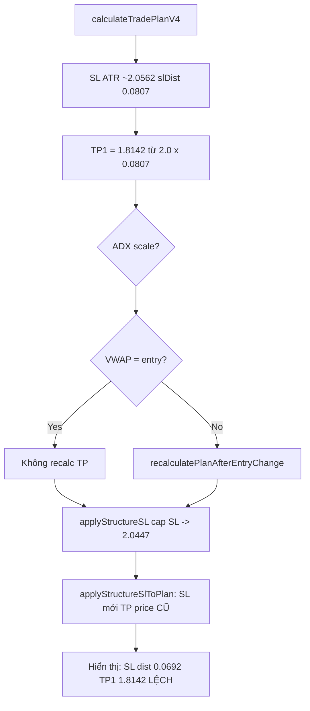

# Báo cáo điều tra: NEAR TP1 lệch slDistance vs Structure SL

**Ngày:** 2026-07-05  
**Phạm vi:** Chỉ đọc code — không sửa gì.  
**Case:** NEAR SHORT @ log 11:30

| Trường | Giá trị |
|--------|---------|
| Entry | 1.9755 |
| SL (Structure cap 3.5%) | 2.0447 |
| slDistance từ SL hiện tại | 0.0692 (= 2.0447 − 1.9755) |
| TP1 thực tế | 1.8142 |
| TP1 kỳ vọng (2.0× slDistance Structure) | 1.8371 |
| slDistance ngược từ TP1 | 0.0807 (= (1.9755 − 1.8142) / 2) |
| Chênh lệch | +0.0115 (+16.6%) |

---

## 1. NEAR đang dùng V3 hay V4 pipeline?

### Kết luận: **V4** (mặc định app), không phải V3 dynamic RR.

### Bằng chứng

**A. Store mặc định `scorerVersion = 'v4'`**

```934:934:store/useTradeStore.ts
  scorerVersion: 'v4',
```

**B. UI / export lấy plan theo scorer đang chọn**

```56:62:services/signalRowView.ts
export function resolveTradePlanV3(
  row: SignalRow,
  version: ScorerVersion = 'v4',
): TradePlanV3 | null {
  const byScorer = row.tradePlansByScorer?.[version];
  if (byScorer != null) return byScorer;
  return version === 'v4' ? (row.tradePlanV3 ?? null) : null;
}
```

**C. Scan luôn tính cả hai plan, nhưng row chính gắn V4**

Trong `scanSignalSymbol()`:

- `calculateTradePlanV3(...)` → `planV3Final`
- `calculateTradePlanV4(...)` → `planV4Final`
- `tradePlansByScorer: { v3: planV3Final, v4: planV4Final }`
- Field legacy `tradePlanV3` thực ra chứa **`planV4Final`** (tên field cũ, dễ gây nhầm):

```979:980:services/signalBoardScan.ts
      tradePlanV3: planV4Final,
      tradePlansByScorer: { v3: planV3Final, v4: planV4Final },
```

**D. Cả V3 lẫn V4 đều dùng RR cố định 2.0 / 3.0 / 4.5 — không phải dynamic V3**

Cả `calculateTradePlanV3` và `buildTradePlanV4Core` đều gọi `calculateOptimalTPs` với:

```typescript
{ fixedRrTargets: RR_TARGETS }  // constants/capitalManagement.ts: tp1=2.0, tp2=3.0, tp3=4.5
```

Khi `fixedRrTargets != null`, `modeFactor` bị tắt (`useCapitalRr ? 1 : ...`) — **không** áp dụng `MARKET_MODE_FACTOR` dynamic cho TP.

**E. TP2 = 2.9160× KHÔNG chứng minh V3**

Giả thuyết “TP2 = 2.916 ≠ 3.0 → V3 dynamic” **sai** vì:

1. V4 cũng target tp2 = 3.0 cố định.
2. Sau Structure SL override, `applyStructureSlToPlan()` **chỉ cập nhật `rrRatio` trên giá TP cũ**, không di chuyển TP.
3. Nếu SL bị thu hẹp (0.0692 thay vì 0.0807) mà TP2 giữ nguyên giá → `rrRatio` hiển thị **giảm** so với 3.0 (vd. ~2.5–2.9 tùy giá TP2), không phải dấu hiệu pipeline V3.

Ví dụ khớp số user (TP2 rr ≈ 2.916 sau Structure):

- Giả sử TP2 price ≈ 1.7737 (có thể do snap support hoặc ADX scale TP)
- `rr2 = (1.9755 − 1.7737) / 0.0692 ≈ 2.916` ✓

Đây là hậu quả **SL mới + TP cũ**, không phải RR target V3.

---

## 2. Thứ tự tính TP vs Structure SL override

### Pipeline thực tế trong `scanSignalSymbol()`

```
1. calculateTradePlanV3 / calculateTradePlanV4
   → entry, SL (ATR/tier), TP từ slDistance gốc

2. scaleTradePlanByAdxGate (nếu ADX gate có multiplier)
   → scale CẢ SL lẫn TP prices

3. applyVWAPEntryToPlan(planV4Final ONLY)
   → nếu VWAP khác entry: recalc SL + TP qua recalculatePlanAfterEntryChange()
   → nếu VWAP = entry: chỉ thêm note, KHÔNG recalc

4. applyStructureSLToPlans()
   → override SL price
   → KHÔNG recalc TP prices

5. invalidatePlanIfStructureRrBelowMin()
   → kiểm tra primaryRR sau bước 4
```

Code:

```920:936:services/signalBoardScan.ts
    if (planV4Final) {
      planV4Final = applyVWAPEntryToPlan(planV4Final, vwapData, directionV4);
    }

    const structureApplied = applyStructureSLToPlans(
      planV3Final,
      planV4Final,
      directionV4,
      klines4h,
    );
    planV3Final = structureApplied.planV3;
    planV4Final = structureApplied.planV4;
    ...
    planV4Final = invalidatePlanIfStructureRrBelowMin(planV4Final, structureSlSource);
```

### Hành vi `applyStructureSlToPlan()` — **root cause**

```635:660:services/signalBoardScan.ts
function applyStructureSlToPlan(plan: TradePlanV3, newSlPrice: number): TradePlanV3 {
  const entry = plan.recommendedEntry;
  const isLong = plan.direction === 'LONG';
  const risk = isLong ? entry - newSlPrice : newSlPrice - entry;
  if (risk <= 0) return plan;

  const rrForTp = (tpPrice: number): number =>
    isLong ? (tpPrice - entry) / risk : (entry - tpPrice) / risk;

  const tp1RR = rrForTp(plan.tp1.price);
  ...
  return {
    ...plan,
    stopLoss: { ...plan.stopLoss, price: newSlPrice, distancePct },
    tp1: { ...plan.tp1, rrRatio: tp1RR },   // ← chỉ rrRatio, price GIỮ NGUYÊN
    tp2: { ...plan.tp2, rrRatio: tp2RR },
    tp3: { ...plan.tp3, rrRatio: tp3RR },
    primaryRR: tp1RR,
  };
}
```

**TP prices không đổi sau Structure SL.** Chỉ SL và nhãn R:R được cập nhật.

So sánh với VWAP recalc (đúng cách):

```768:784:services/tradePlanV3.ts
  const { tp1, tp2, tp3 } = calculateOptimalTPs(
    plan.direction,
    newEntry,
    { ...plan.stopLoss, price: newSL },
    ...
    { slDistanceOverride: newSlDistance, fixedRrTargets: baseRR },
  );
```

VWAP path **gọi lại `calculateOptimalTPs`** — Structure SL path **không**.

---

## 3. slDistance 0.0807 đến từ đâu?

### Khớp số NEAR

| Bước | SL (SHORT) | slDistance | TP1 (2.0×) |
|------|------------|------------|------------|
| **Trước Structure cap** (ATR SL) | ≈ **2.0562** | **0.0807** | **1.8142** ✓ |
| **Sau Structure cap 3.5%** | **2.0447** | **0.0692** | vẫn **1.8142** (frozen) |
| Kỳ vọng nếu recalc TP | 2.0447 | 0.0692 | **1.8371** |

Kiểm tra:

- Pre-cap SL: `1.9755 + 0.0807 = 2.0562` → `(2.0562 / 1.9755 − 1) × 100 ≈ 4.08%` **> 3.5% cap**
- Cap: `1.9755 × 1.035 = 2.0446425 ≈ 2.0447` ✓
- TP1 frozen: `1.9755 − 0.0807 × 2.0 = 1.8141 ≈ 1.8142` ✓

**0.0807 = khoảng cách SL ATR gốc (trước Structure cap), dùng khi tính TP ở bước 1.**

Structure SL cho SHORT:

```229:230:services/structureSL.ts
  let slPrice = Math.max(structureSL, atrSL);
  slPrice = capStructureSlPrice('SHORT', entryPrice, atrSL, slPrice, atr);
```

Cap kéo SL từ ~2.0562 xuống 2.0447 (gần entry hơn = rủi ro nhỏ hơn), nhưng TP vẫn neo theo SL rộng hơn.

### Hậu quả hiển thị R:R

Sau override (chỉ đổi rrRatio):

- `primaryRR = (1.9755 − 1.8142) / 0.0692 ≈ **2.33**` — không còn 2.00
- User so TP1 với SL Structure 2.0× → thấy lệch; log có thể vẫn ghi tp1.price = 1.8142 nhưng rrRatio ≠ 2.0

---

## 4. VWAP có giải thích được không?

### Kết luận: **Không phải nguyên nhân chính** (với số user cung cấp).

User nói VWAP entry = 1.9755 (= entry hiển thị). Trong code:

```840:848:services/tradePlanV3.ts
  if (Math.abs(vwapEntry - plan.recommendedEntry) < 1e-9) {
    return {
      ...plan,
      entryOptions: [...],
      entryNote: `VWAP ${vwapEntry.toFixed(2)} — ${signal.entryReason}`,
    };
  }
```

→ **Không recalc** SL/TP khi VWAP trùng entry optimal.

Kịch bản user thử (entry gốc 1.9740 → VWAP 1.9755):

- SL dịch +0.0015 → slDistance ≈ 0.0707 — vẫn xa 0.0807
- 0.0807 chỉ khớp **SL ATR pre-cap ~2.0562**, không khớp VWAP delta nhỏ

**Lưu ý:** VWAP chỉ chạy trên `planV4Final`, không trên `planV3Final`.

---

## 5. Có cần chuyển NEAR sang V4 không?

**Không.** NEAR đã chạy V4 plan pipeline. Chuyển scorer không sửa lỗi vì:

- V3 plan trong cùng scan cũng qua `applyStructureSlToPlan()` — **cùng bug**
- V3 và V4 dùng chung `calculateOptimalTPs` + `RR_TARGETS` fixed
- Khác biệt V3/V4 chủ yếu ở **SL multiplier / scoring**, không ở logic Structure TP recalc

---

## 6. File và dòng cần sửa (tham khảo — chưa sửa ở task này)

| Ưu tiên | File | Hàm / vùng | Việc cần làm |
|---------|------|------------|--------------|
| **P0** | `services/signalBoardScan.ts` | `applyStructureSlToPlan()` L635–661 | Sau khi set SL mới, **recalc TP prices** từ `slDistance` mới (giống `recalculatePlanAfterEntryChange` / gọi `calculateOptimalTPs` với `slDistanceOverride`) |
| **P0** | `services/signalBoardScan.ts` | `applyStructureSLToPlans()` L685–722 | Đảm bảo cả planV3 và planV4 đều recalc; truyền `fixedRrTargets`, `marketMode`, key levels nếu cần structure snap |
| **P1** | `services/signalBoardScan.ts` | `applyStructureSlToPlan()` | Cập nhật `stopLoss.maxLossUSDT`, `atrDistance`, `distancePct` đầy đủ (hiện chỉ đổi `price` + `distancePct`) |
| **P2** | `services/tradePlanV3.ts` | `recalculatePlanAfterEntryChange()` | Có thể tách helper dùng chung cho Structure SL recalc (tránh duplicate) |
| **P3** | Test | `services/__tests__/structureSL*.test.ts` hoặc scan integration | Case: SHORT SL cap 3.5% → TP1 = entry − 2× newSlDistance |

### Fix pattern đề xuất (conceptual)

```typescript
// Sau khi có newSlPrice và newSlDistance:
const { tp1, tp2, tp3 } = calculateOptimalTPs(
  plan.direction,
  entry,
  { ...plan.stopLoss, price: newSlPrice },
  plan.decision,
  plan.marketMode,
  plan.groupScores,
  resistances, supports,  // cần truyền từ plan hoặc scan context
  plan.positionSize,
  leverage,
  plan.winProbabilityEstimate,
  { slDistanceOverride: newSlDistance, fixedRrTargets: RR_TARGETS },
);
```

Hoặc gọi `recalculatePlanAfterEntryChange(plan, entry, { shiftSlWithEntry: false })` rồi override SL price — cần review kỹ vì helper hiện shift SL theo entry delta.

---

## 7. Tóm tắt executive

| Câu hỏi | Trả lời |
|---------|---------|
| Pipeline NEAR? | **V4** (default), plan = `planV4Final` / `tradePlansByScorer.v4` |
| Thứ tự TP vs Structure SL? | TP tính **trước**; Structure SL **override SL sau**; **TP không recalc** |
| 0.0807 từ đâu? | **slDistance SL ATR gốc ~2.0562** (4.08% entry), trước cap 3.5% → 2.0447 |
| VWAP? | Entry = VWAP → **không recalc**; không giải thích 0.0807 |
| Chuyển V4? | **Đã V4**; chuyển scorer không fix |
| Bug? | **`applyStructureSlToPlan` giữ TP cũ khi SL đổi** — mismatch có hệ thống khi Structure cap thu hẹp SL |

---

## 8. Sơ đồ pipeline



---

*Báo cáo chỉ đọc — không thay đổi source code.*
