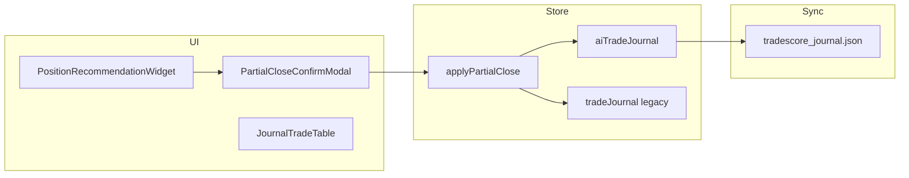

# Chốt một phần (Partial Close) & Journal — Báo cáo triển khai

**Ngày cập nhật:** 2026-06-29  
**Liên quan:** [POSITION_ADVISOR_V4_REPORT.md](./POSITION_ADVISOR_V4_REPORT.md) · [JOURNAL_STORAGE_REPORT.md](./JOURNAL_STORAGE_REPORT.md)  
**Phạm vi:** Chốt 30%/50% từ Position Advisor · PnL tách realized/unrealized · Journal table live · Gist sync

---

## Tóm tắt

| Hạng mục | Trạng thái |
|----------|------------|
| Chốt một phần thật (không còn placeholder alert) | ✅ |
| Schema `partialCloses[]` trên `AiTradeJournalEntry` | ✅ |
| UI Signal Board (`OpenPositionPnl` + modal xác nhận) | ✅ |
| Journal table: PnL / STATUS / Khuyến nghị / Close reason | ✅ |
| Thống kê cuối trang journal | ✅ |
| Sync `tradescore_journal.json` (Gist) | ✅ Tự động qua full journal |
| Unit tests | ✅ 6 + 4 + 17 (partial / journal / advisor) |

---

## 1. Luồng chốt một phần

```
Position Advisor khuyến nghị PARTIAL_TP1 | PARTIAL_TP2 | PARTIAL_CLOSE_30
    → Bấm nút trên widget (OpenPositionPnl)
    → PartialCloseConfirmModal: "Chốt X% vị thế tại giá hiện tại?"
    → applyPartialClose() (store)
    → Ghi PartialCloseRecord + giảm plan.sizeActual
    → Đồng bộ tradeJournal legacy + trigger Gist sync
```

### Tỷ lệ chốt (% trên **size gốc**)

| Loại khuyến nghị | `PartialCloseReason` | % chốt |
|------------------|----------------------|--------|
| Chốt 50% TP1 | `PARTIAL_TP1` | 50% |
| Chốt thêm 30% TP2 | `PARTIAL_TP2` | 30% |
| Chốt 30% (funding/squeeze) | `PARTIAL_CLOSE_30` | 30% |

### Nhiều lần chốt

Mỗi lần chốt tính **% trên size gốc** (`plan.sizeOriginal`), không phải % phần còn lại.

| Bước | Đã chốt (gốc) | Còn lại |
|------|---------------|---------|
| Mở lệnh 100 USDT margin | 0% | 100% |
| Chốt 50% (PARTIAL_TP1) | 50% | 50% |
| Chốt thêm 30% (PARTIAL_TP2) | 80% | 20% |
| Đóng hết phần còn lại | 100% | 0% |

**Ví dụ:** 100 USDT → chốt 50% → `sizeActual = 50` → chốt 30% → `sizeActual = 20`.

---

## 2. Schema dữ liệu

### `PartialCloseRecord` (`constants/aiJournal.ts`)

```typescript
interface PartialCloseRecord {
  partialClosePercent: number;      // % trên size gốc
  partialClosePrice: number;        // giá mark lúc chốt
  partialCloseTime: number;         // timestamp ms
  partialCloseReason: PartialCloseReason;
  realizedPnlUSDT: number;
  realizedPnlPct: number;
  closedSizeUsdt: number;           // margin USDT đã chốt
}
```

### Trên `AiTradeJournalEntry`

| Field | Mô tả |
|-------|--------|
| `partialCloses?: PartialCloseRecord[]` | Lịch sử các lần chốt (OPEN và sau khi đóng hết) |
| `plan.sizeOriginal?: number` | Margin gốc — cố định từ lần chốt đầu |
| `plan.sizeActual` | Margin **còn lại** sau mỗi lần chốt |

### Legacy `StoredTradeJournalEntry` (đồng bộ)

| Field | Mô tả |
|-------|--------|
| `partialCloses` | Copy từ ai journal |
| `sizeOriginal` | Margin gốc |
| `size` | Size còn lại (= `sizeActual`) |
| `realizedPnlUsdt` | Tổng realized từ partial (cache hiển thị) |

**Tương thích ngược:** Entry cũ không có `partialCloses` → hoạt động như trước.

---

## 3. Logic & service

### `services/partialClose.ts`

| Hàm | Vai trò |
|-----|---------|
| `applyPartialCloseToEntry()` | Tính record, validate tổng % ≤ 100, cập nhật entry |
| `partialClosePercentForReason()` | 50 / 30 / 30 |
| `sumPartialClosePercent()` | Tổng % đã chốt |
| `sumRealizedPartialPnl()` | Tổng USDT realized từ partial |
| `partialCloseBadgeLabel()` | `"Đã chốt X%"` |
| `recommendationTypeToPartialReason()` | Map `RecommendationType` → reason |

### `store/useTradeStore.ts`

- **`applyPartialClose({ aiEntryId, legacyEntryId?, markPrice, reason })`**
  - Cập nhật `aiTradeJournal`
  - `updateJournalEntry` legacy nếu có
  - `triggerJournalDriveSync()`

### PnL khi đóng hết (`computeTradePnl`)

```
Tổng PnL = Σ(realized từ partialCloses) + PnL phần còn lại tại exitPrice
ROE %    = totalPnlUSDT / sizeOriginal × 100
```

---

## 4. UI — Signal Board (lệnh đang chạy)

| Thành phần | File |
|------------|------|
| Modal xác nhận | `components/PartialCloseConfirmModal.tsx` |
| Wire action + PnL split | `components/OpenPositionPnl.tsx` |
| Badge "Đã chốt X%" | `components/PositionRecommendation.tsx` |
| Nút hành động | Chốt 50% / Chốt thêm 30% / Chốt 30% |

### PnL trên widget (khi đã chốt một phần)

| Dòng | Nội dung |
|------|----------|
| PnL đã chốt | Tổng realized từ `partialCloses` |
| PnL chưa chốt | Unrealized trên `sizeActual` còn lại |
| Tổng PnL | realized + unrealized |

Dùng `computeSplitPositionPnl()` trong `utils/positionPnl.ts`.

---

## 5. UI — Journal table

### `hooks/useJournalMarketSync.ts`

| Output | Mô tả |
|--------|--------|
| `markBySymbol` | Giá mark từ signal board |
| `unrealizedById` | Unrealized trên phần còn lại (OPEN) |
| `pnlBreakdownById` | `{ realized, unrealized, total, closedPercent, remainingPercent }` |
| `advisorLabelById` | Khuyến nghị live + prefix `"Đã chốt X% · …"` |

### `components/journal/JournalTradeTable.tsx`

| Cột | Khi có partial (OPEN) |
|-----|------------------------|
| **PnL** | 3 dòng: Realized (X%) · Unrealized (Y%) · Tổng |
| **STATUS** | `RUNNING • PARTIAL 50%` — màu cam `#F97316` |
| **Khuyến nghị** | `Đã chốt 50% · [label advisor]` |
| **Close reason** | (khi đã đóng hết) xem mục 6 |

Chưa chốt partial → giữ hiển thị 1 dòng PnL như cũ.

**Giữ nguyên:** pagination 5 dòng/trang, filter, màu WIN/LOSS, action STOP/Fill/Huỷ.

### Thống kê cuối trang — `JournalPartialStats`

Trên `JournalScreen` (toàn bộ journal visible):

- `Đã chốt một phần: X lệnh`
- `Tổng realized từ chốt một phần: +X.XX USDT`

---

## 6. Close reason sau chốt partial rồi đóng hết

`formatPartialCloseExitReason()` trong `services/journalService.ts`:

**Ví dụ:**

```
Chốt 50% tại 110 → Đóng 50% còn lại tại 112
```

Nhiều lần partial:

```
Chốt 50% tại 110 → Chốt 30% tại 112 → Đóng 20% còn lại tại 115
```

Ghi vào `outcome.closeReason` khi `closeTradeEntry()` nếu entry có `partialCloses`.

---

## 7. GitHub Gist sync

File: `tradescore_journal.json` (wrapper `DriveFileWrapper`).

- Upload: `bridge.getJournal()` → toàn bộ `aiTradeJournal[]`
- **`partialCloses` và mọi field trong `PartialCloseRecord` được serialize tự động** — không strip field
- Trigger: `applyPartialClose`, `closeTradeEntry`, thêm/sửa journal khác qua `triggerJournalDriveSync()`

**Lưu ý merge pull:** Merge theo `id` — entry đã tồn tại local không bị ghi đè bởi remote (thiết kế hiện tại). APK master upload full journal khi sync.

---

## 8. Thay đổi Position Advisor (OPPOSITE_STRONG)

**File:** `services/positionAdvisorV3.ts` — rule `OPPOSITE_STRONG`

| Ngưỡng | Trước | Sau |
|--------|-------|-----|
| BẬT (chưa CLOSE_REVERSE) | ≥ 11.0đ | ≥ 11.0đ (giữ) |
| TẮT hysteresis (đang CLOSE_REVERSE) | < 10.5đ | **< 10.0đ** |

Chỉ đổi 1 con số hysteresis; priority, urgency, action type không đổi.

---

## 9. Helpers hiển thị journal (`journalService.ts`)

| Hàm | Mục đích |
|-----|----------|
| `buildJournalOpenPnlBreakdown()` | PnL tách cho OPEN + partial |
| `resolveJournalStatusLabel()` | `RUNNING • PARTIAL X%` |
| `hasJournalPartialClose()` | Có partial hay không |
| `enrichAdvisorLabelWithPartial()` | Prefix khuyến nghị live |
| `formatPartialCloseExitReason()` | Close reason sau đóng hết |
| `computeJournalPartialStats()` | Đếm lệnh + tổng realized |

---

## 10. Tests

| File | Nội dung |
|------|----------|
| `services/partialClose.test.ts` | Logic 50%/30%, reject >100% |
| `services/partialClose.journal.test.ts` | `computeTradePnl` + partial |
| `services/journalPartialDisplay.test.ts` | STATUS, PnL breakdown, close reason, Gist JSON shape |
| `services/positionAdvisorV3.test.ts` | OPPOSITE_STRONG + rule matrix |

---

## 11. Sơ đồ dữ liệu



---

## 12. File tham chiếu

| File | Vai trò |
|------|---------|
| `constants/aiJournal.ts` | Schema `PartialCloseRecord` |
| `services/partialClose.ts` | Core logic chốt một phần |
| `store/useTradeStore.ts` | `applyPartialClose`, `closeTradeEntry` |
| `components/PartialCloseConfirmModal.tsx` | Modal xác nhận |
| `components/OpenPositionPnl.tsx` | Signal Board PnL + action |
| `components/PositionRecommendation.tsx` | Widget + badge |
| `hooks/useJournalMarketSync.ts` | Live mark, PnL, advisor |
| `components/journal/JournalTradeTable.tsx` | Bảng journal |
| `components/journal/JournalPartialStats.tsx` | Footer thống kê |
| `screens/JournalScreen.tsx` | Màn journal chính |
| `components/journal/ActiveTradesPanel.tsx` | Panel lệnh đang chạy |
| `services/journalService.ts` | Display helpers + `computeTradePnl` |
| `utils/positionPnl.ts` | `computeSplitPositionPnl` |
| `services/githubSyncService.ts` | Upload Gist |
| `docs/POSITION_ADVISOR_V4_REPORT.md` | Mô tả advisor & khuyến nghị |

---

## 13. Việc chưa làm / giới hạn

| Hạng mục | Ghi chú |
|----------|---------|
| Chốt partial trên sàn thật (Binance API) | Chỉ ghi journal nội bộ |
| Merge Gist 2 chiều cho partial trên entry đã có local | Entry trùng `id` không merge field con |
| V4.1 Position Management | Module `services/v41/` chưa tích hợp app |
