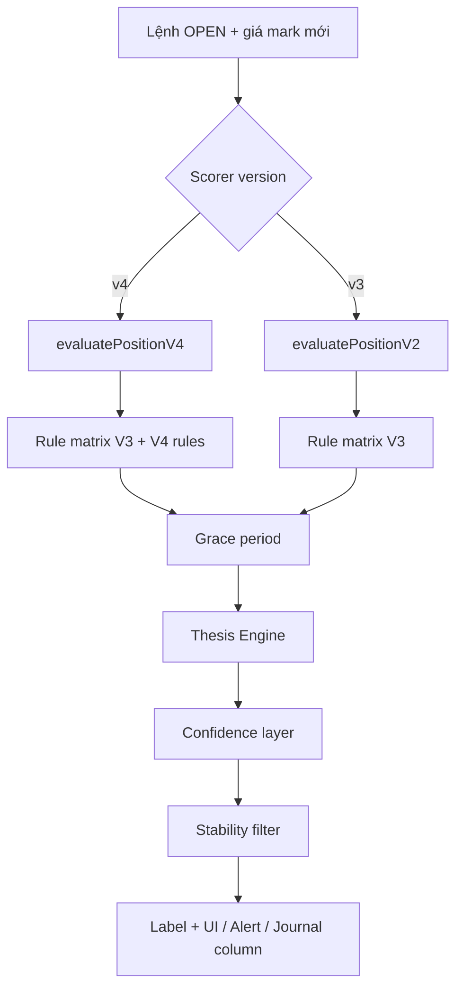

# Position Advisor V4 — Mô tả & Khuyến nghị sau khi vào lệnh

**Ngày cập nhật:** 2026-06-29  
**Module chính:** `services/positionAdvisorV4.ts` (mở rộng `positionAdvisorV3.ts`)  
**UI:** `components/OpenPositionPnl.tsx`, `components/PositionRecommendation.tsx`, Journal live column

---

## Tóm tắt

**Position Advisor V4** là hệ thống đánh giá lệnh **đang mở** sau khi đã vào lệnh. Mỗi lần quét thị trường (~1 phút), app tính lại score V3/V4 theo hướng lệnh, so sánh với điều kiện lúc mở, rồi đưa ra **một khuyến nghị duy nhất** — ví dụ: giữ lệnh, chốt một phần, dời SL, đóng ngay, đóng khẩn cấp.

V4 **kế thừa toàn bộ rule matrix V3** và bổ sung **2 rule riêng** cho funding & squeeze risk (L6/L11 của Scorer V4).

```
Scan thị trường
    → Rule matrix (ưu tiên cao → thấp)
    → Grace period (lệnh mới < 20 phút)
    → Thesis Engine (sức khỏe luận điểm vào lệnh)
    → Confidence Decision (delta confidence scan-to-scan)
    → Stability filter (xác nhận nhiều lần quét)
    → Khuyến nghị hiển thị + push notification
```

---

## Khi nào chạy

| Ngữ cảnh | File | Hàm |
|----------|------|-----|
| Lệnh đang chạy trên Signal Board | `OpenPositionPnl.tsx` | `evaluatePositionV4()` khi `scorerVersion === 'v4'` |
| Cột "Khuyến nghị" live trên Journal | `useJournalMarketSync.ts` | `buildCloseAdvisorContext()` → label |
| Background / foreground alert | `positionAdvisorAlertRunner.ts` | `runPositionAdvisorAlerts()` |
| Dialog xác nhận đóng lệnh | `positionAdvisorExitTracking.ts` | `advisorActionDisplayLabel()` |

Lệnh V3 dùng `evaluatePositionV2()` — cùng pipeline nhưng **không** có rule FUNDING_REVERSAL / SQUEEZE_RISK_ALERT.

---

## Pipeline đánh giá (V4)

Entry point: `evaluatePositionV4()` trong `positionAdvisorV4.ts`.

| Bước | Mô tả |
|------|--------|
| 1. **Snapshot & Memory** | Lưu thesis lúc vào lệnh (`TradeThesisSnapshot`) + bộ nhớ scan (`PositionMemory`) |
| 2. **Rule matrix** | Chạy 11 rule V3 + 2 rule V4; rule match cao nhất thắng |
| 3. **Grace period** | Lệnh mới < 20 phút và giá chưa đi ≥ 0.5×ATR → giảm nhạt khuyến nghị đóng/chốt sớm |
| 4. **Thesis Engine** | Điều chỉnh theo sức khỏe luận điểm (HEALTHY → WARNING → EXIT → INVALID) |
| 5. **Confidence layer** | Phản ứng khi confidence scan giảm/tăng mạnh so với scan trước |
| 6. **Stability** | Khuyến nghị mới phải xác nhận N lần quét liên tiếp mới hiển thị |
| 7. **Persist** | Cập nhật `lastFundingState`, `lastSqueezeRiskLevel`, CVD flag vào journal |

---

## Ma trận rule — thứ tự ưu tiên

Rule có **priority** cao hơn thắng. V4 chèn thêm 2 rule giữa CVD và TP_HIT.

| Priority | Rule | Loại khuyến nghị | Urgency | Mô tả ngắn |
|----------|------|------------------|---------|------------|
| **100** | `HARD_BLOCK` | `CLOSE_URGENT` | CRITICAL | Hard block BTC/Funding/squeeze — đang lời → "Chốt lời ngay"; đang lỗ → "Đóng khẩn cấp" |
| **95** | `GROUP_BLOCK` | `CLOSE_NOW` | MEDIUM | Group block — đang lời → "Chốt lời"; đang lỗ → "Đóng lệnh" |
| **90** | `BTC_REVERSAL` | `CLOSE_URGENT` | HIGH | L8 BTC đảo chiều mạnh — không thuận hướng lệnh |
| **85** | `OPPOSITE_STRONG` | `CLOSE_REVERSE` / `CLOSE_NOW` | HIGH | Setup ngược chiều ≥ 11đ (hysteresis 10.5đ nếu đang CLOSE_REVERSE) |
| **80** | `CVD_DIVERGENCE` | `PARTIAL_TP1` / `CLOSE_NOW` | HIGH | CVD phân kỳ + L5 âm; xa TP1 → chốt 50%; gần TP1 → đóng |
| **75** | `FUNDING_REVERSAL` ⭐V4 | `HOLD` → `PARTIAL_CLOSE_30` / `CLOSE_NOW` | LOW→HIGH | Funding momentum đảo chiều (2 bước xác nhận) |
| **70** | `SQUEEZE_RISK_ALERT` ⭐V4 | `PARTIAL_CLOSE_30` / `HOLD` / `HOLD_MOVE_SL` | HIGH | Squeeze HIGH → EXTREME cùng hướng |
| **60** | `TP_HIT` | `PARTIAL_TP1` / `PARTIAL_TP2` | MEDIUM | Đã chạm TP1; gần TP2 → chốt thêm 30% |
| **50** | `SCORE_DROP_NEAR_TP1` | `PARTIAL_TP1` | MEDIUM | Score < 8 khi đã đi ≥ 50% đến TP1 |
| **40** | `MOVE_SL_BE` | `HOLD_MOVE_SL` | MEDIUM | Lời tốt, ≥ 60% đến TP1, ≥ 1.5R → dời SL về entry |
| **20** | `HOLD_STRONG` | `HOLD` | LOW | Score ≥ 9đ (hysteresis 8.5đ), không block |
| **10** | `HOLD_CONDITIONAL` | `HOLD` | LOW | Score ≥ 7đ (hysteresis 6.5đ) — giữ có điều kiện |
| **0** | `FALLBACK` | `HOLD` | LOW | Không rule nào match — "Tiếp tục giữ" |

⭐ = chỉ có trên V4.

### Rule ngoài grace period (luôn áp dụng ngay)

`HARD_BLOCK`, `GROUP_BLOCK`, `BTC_REVERSAL`, `OPPOSITE_STRONG` — rủi ro thị trường ngoài vị thế, **không** bị trì hoãn khi lệnh mới mở.

### Rule chịu grace period

`CVD_DIVERGENCE`, `FUNDING_REVERSAL`, `SQUEEZE_RISK_ALERT`, `TP_HIT`, `SCORE_DROP_NEAR_TP1`, `MOVE_SL_BE` — khi lệnh < 20 phút **và** giá chưa đi ≥ 0.5×ATR(1H), các action đóng/chốt/dời SL bị tạm ẩn → hiển thị **"Giữ lệnh (mới mở X phút)"**.

---

## Rule V4 chi tiết

### FUNDING_REVERSAL (priority 75)

**Điều kiện chuyển trạng thái funding:**

| Hướng lệnh | lastState → currentState |
|------------|--------------------------|
| LONG | `SHORT_SQUEEZE_BUILDING` → `SHORT_EUPHORIA_FADING` |
| SHORT | `EXTREME_LONG_EUPHORIA` → `LONG_EUPHORIA_FADING` |

**Luồng 2 bước:**

1. **Lần 1:** `HOLD` — "Giữ — xác nhận funding" (set `lastFundingReversalPending`)
2. **Lần 2 (đã pending):**

| PnL | Hành động | Label |
|-----|-----------|-------|
| Lời | `PARTIAL_CLOSE_30` | Chốt 30% — funding đảo |
| Lỗ < 50% maxLoss (SL) | `HOLD` | Giữ — funding yếu dần |
| Lỗ ≥ 50% maxLoss | `CLOSE_NOW` | Đóng lệnh |

`maxLossUSDT` = lỗ tối đa nếu chạm SL (`computePositionMaxLossUSDT`). Khi thiếu SL/maxLoss → threshold = 0 → ưu tiên đóng cẩn trọng hơn giữ im lặng.

### SQUEEZE_RISK_ALERT (priority 70)

**Điều kiện:** Squeeze leo thang **HIGH → EXTREME** cùng hướng với lệnh (`LONG_SQUEEZE` hoặc `SHORT_SQUEEZE`).

| PnL | Hành động | Label |
|-----|-----------|-------|
| Lời | `PARTIAL_CLOSE_30` | Chốt 30% — squeeze EXTREME |
| Lỗ < 40% maxLoss | `HOLD` | Giữ — squeeze EXTREME |
| Lỗ ≥ 40% maxLoss | `HOLD_MOVE_SL` | Dời SL gần hơn — squeeze EXTREME |

---

## Các loại khuyến nghị (RecommendationType)

| Type | Ý nghĩa trader | Nhãn UI thường gặp | Nút hành động |
|------|----------------|---------------------|---------------|
| `HOLD` | Giữ lệnh | Tiếp tục giữ / Giữ có điều kiện | Không nút (chỉ xem lý do) |
| `HOLD_MOVE_SL` | Dời SL bảo vệ vốn | Dời SL về entry / Siết SL | **Dời SL về Entry** → mở form chỉnh SL |
| `PARTIAL_TP1` | Chốt ~50% tại TP1 | Chốt 50% TP1 / Chốt 50% ngay | **Chốt 50% ngay** (placeholder alert) |
| `PARTIAL_TP2` | Chốt thêm ~30% tại TP2 | Chốt thêm 30% | **Chốt thêm 30%** (placeholder) |
| `PARTIAL_CLOSE_30` | Chốt 30% (funding/squeeze) | Chốt 30% — funding/squeeze | **Chốt 30% ngay** (placeholder) |
| `CLOSE_NOW` | Đóng toàn bộ | Đóng lệnh / Chốt lời | **Đóng lệnh** → modal xác nhận |
| `CLOSE_URGENT` | Đóng ngay — rủi ro cao | Đóng khẩn cấp / Chốt lời ngay | **Đóng ngay** → modal xác nhận |
| `CLOSE_REVERSE` | Đóng vì setup đảo chiều | Chốt lời, cẩn thận đảo chiều | **Đóng / chốt (đảo chiều)** |

> **Lưu ý:** Chốt một phần (30%/50%) hiện hiển thị alert "sẽ hỗ trợ đầy đủ trong bản cập nhật tiếp theo" — logic khuyến nghị đã có, thao tác journal chưa hoàn thiện.

---

## Bảng nhãn hiển thị (Journal & đóng lệnh)

Mapping trong `positionAdvisorExitTracking.ts`:

| Action code | Nhãn đầy đủ |
|-------------|-------------|
| `HOLD_STRONG` | 🟢 GIỮ LỆNH (Hold Strong) |
| `HOLD_CONDITIONAL` | 🟡 GIỮ CÓ ĐIỀU KIỆN (Hold Conditional) |
| `PARTIAL_CLOSE_30` | 🟠 CHỐT 30% (Partial Close) |
| `PARTIAL_TP1` | 🟠 CHỐT TP1 (Partial TP1) |
| `CLOSE_NOW` | 🔴 ĐÓNG NGAY (Close Now) |
| `CLOSE_URGENT` | 🚨 ĐÓNG KHẨN CẤP (Close Urgent) |
| `MOVE_SL_BE` | 🔵 DỜI SL VỀ BE |
| `MOVE_SL_TIGHTER` | 🔵 SIẾT SL CHẶT HƠN |
| `FUNDING_REVERSAL` | ⚠️ CẢNH BÁO FUNDING ĐẢO CHIỀU |
| `SQUEEZE_ALERT` | ⚠️ CẢNH BÁO SQUEEZE RISK |
| `PLAN_EXPIRED` | ⏱ PLAN HẾT HẠN |

**Nhóm compact** (dialog đóng lệnh):

- 🟢 GIỮ LỆNH — hold
- 🟡 CHỐT MỘT PHẦN — partial / move SL
- 🔴 ĐÓNG LỆNH — close now/urgent
- 🟠 CẢNH BÁO — XEM XÉT ĐÓNG — funding/squeeze

Khi đóng lệnh thủ công, trader có thể chọn lý do **"Theo khuyến nghị app"** (`FOLLOW_ADVISOR`) để ghi nhận đã làm theo advisor.

---

## Grace Period

| Tham số | Giá trị |
|---------|---------|
| Thời gian tối thiểu | **20 phút** (`GRACE_PERIOD_MS`) |
| Biên giá thoát grace | **0.5 × ATR(1H)** từ entry |
| ATR | Ưu tiên ATR 1H từ Scorer; fallback ≈ khoảng cách SL / 2 |

Thoát grace khi **một trong hai** điều kiện sai: đã mở ≥ 20 phút **hoặc** giá đã đi đủ xa.

---

## Stability Filter (chống nhảy khuyến nghị)

Mỗi lần đổi loại khuyến nghị cần xác nhận liên tiếp:

| Urgency | Số lần quét cần xác nhận |
|---------|--------------------------|
| CRITICAL | 1 |
| HIGH | 2 |
| MEDIUM | 3 |
| LOW | 1 |

Trong lúc chờ: hiển thị khuyến nghị cũ + ghi chú **"Đang xác nhận tín hiệu (1/2 lần)"**.

---

## Thesis Engine (sức khỏe luận điểm vào lệnh)

So sánh điều kiện lúc vào lệnh với scan hiện tại — 6 thành phần có trọng số:

| Thành phần | Trọng số |
|------------|----------|
| Trend | 30% |
| BTC alignment | 15% |
| Volume | 15% |
| Breakout | 15% |
| Structure | 15% |
| Support/Resistance | 10% |

**Trạng thái thesis (có hysteresis):**

| Score | State | Ý nghĩa |
|-------|-------|---------|
| ≥ 80 | HEALTHY | Thesis còn vững — có thể làm mềm khuyến nghị partial/move SL |
| 60–79 | WARNING | Thesis suy yếu — theo dõi sát |
| 40–59 | EXIT_RECOMMENDED | Thesis đang phá vỡ — tăng áp lực thoát |
| < 40 | THESIS_INVALID | Force củng cố CLOSE |

Rule CRITICAL / CLOSE_URGENT / funding / squeeze **miễn nhiễm** thesis soften.

---

## Confidence Decision Layer

So sánh confidence scan hiện tại vs scan trước (hoặc lúc entry):

| Delta (điểm) | Phân loại |
|--------------|-----------|
| \|Δ\| < 3 | NEUTRAL |
| 3–5 | MINOR_DROP / MINOR_RISE |
| 6–12 | MAJOR_DROP / MAJOR_RISE |
| > 12 | COLLAPSE / SURGE |

- **COLLAPSE / MAJOR_DROP** + thesis yếu → tăng áp lực đóng
- **SURGE / MAJOR_RISE** + thesis HEALTHY → có thể giữ khi score giảm nhẹ

---

## UI — Widget khuyến nghị

`PositionRecommendationWidget` hiển thị:

- Viền trái theo urgency: CRITICAL/HIGH đỏ, MEDIUM vàng, LOW xám
- 5 chấm confidence (mỗi chấm ≈ 20%)
- Badge **"Mới mở Xp — đang theo dõi"** khi grace period active
- Mở rộng → danh sách lý do (tối đa 5 dòng)
- Nút hành động khi `type !== 'HOLD'`

---

## Push notification

`runPositionAdvisorAlerts()`:

- Quét tất cả lệnh OPEN trong journal
- Gọi `evaluatePositionV4` / V2 tùy scorer
- Gửi push khi **urgency tăng** so với lần trước
- CRITICAL có thể lặp sau **5 phút** (throttle)
- Tuân theo cài đặt notification của user

---

## Dữ liệu lưu trên journal (cho V4)

| Field | Mục đích |
|-------|----------|
| `lastFundingState` | So sánh transition FUNDING_REVERSAL |
| `lastFundingReversalPending` | Bước 1 xác nhận funding |
| `lastSqueezeRiskLevel` / `lastSqueezeRiskDirection` | Phát hiện leo thang HIGH→EXTREME |
| `lastCVDDivergenceActive` | CVD divergence 2-step |
| `tradeThesisSnapshot` | Snapshot điều kiện lúc vào |
| `positionMemory` | Thesis state, confidence history giữa các scan |

---

## Sơ đồ luồng (tóm tắt)



---

## File tham chiếu

| File | Vai trò |
|------|---------|
| `services/positionAdvisorV4.ts` | Entry V4, rule funding & squeeze |
| `services/positionAdvisorV3.ts` | Rule matrix V3, thesis, confidence |
| `services/gracePeriod.ts` | Grace 20 phút / 0.5 ATR |
| `services/recommendationStability.ts` | Xác nhận đa scan |
| `services/positionAdvisorExitTracking.ts` | Label journal & đóng lệnh |
| `services/positionAdvisorAlertRunner.ts` | Push notification |
| `components/OpenPositionPnl.tsx` | UI lệnh đang chạy |
| `components/PositionRecommendation.tsx` | Widget khuyến nghị |
| `hooks/useJournalMarketSync.ts` | Cột khuyến nghị live |
| `components/journal/JournalTradeTable.tsx` | Hiển thị cột |

---

## Phân biệt V4 Advisor vs V4.1

| | Position Advisor **V4** (production) | V4.1 `services/v41/` |
|--|--------------------------------------|----------------------|
| Trạng thái | ✅ Đang dùng trong app | ❌ Chưa tích hợp app |
| Input | Score V3/V4 + funding + squeeze | Market Intelligence pipeline riêng |
| Mục tiêu | Quản lý lệnh **đã mở** | Entry + visibility + setup mới |

Position Advisor V4 **không** dùng engine V4.1 (`marketConfidenceEngine`, v.v.).
