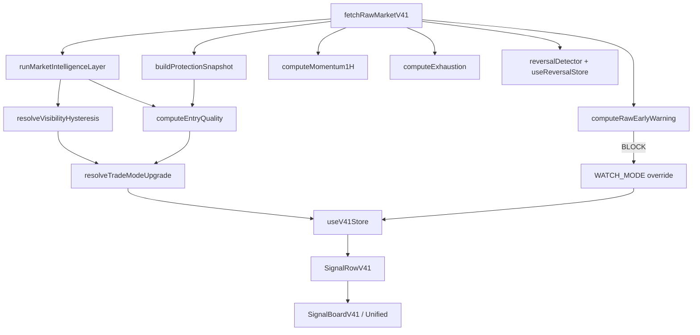

# TradeScore V4.1 — Tài liệu đầy đủ

> Phạm vi: **chỉ V4.1** (Market Intelligence, scan, entry, reversal, momentum, exhaustion, UI tab V4.1 & phần V4.1 trên tab Unified).  
> Không bao gồm Scorer V3/V4, journal chung, Drive sync, capital, v.v.

**Version tài liệu:** 1.0.5 · **Ngày:** 2026-07-05  
**Tham chiếu kiến trúc:** `docs/V4.1_ARCHITECTURE.md`, `docs/V4.1_FORMULAS.md`

---

## Mục lục

1. [Tổng quan pipeline](#1-tổng-quan-pipeline)
2. [Cấu trúc file & module](#2-cấu-trúc-file--module)
3. [Bước 0 — Raw Market Data](#3-bước-0--raw-market-data)
4. [Bước 1 — Market Intelligence (4 engine)](#4-bước-1--market-intelligence-4-engine)
5. [Bước 2 — Visibility Manager](#5-bước-2--visibility-manager)
6. [Bước 3 — Entry Quality / Opportunity](#6-bước-3--entry-quality--opportunity)
7. [Momentum 1H Engine](#7-momentum-1h-engine)
8. [Exhaustion Engine & RESCUE](#8-exhaustion-engine--rescue)
9. [Early Warning Engine](#9-early-warning-engine)
10. [Reversal & Counter-trend](#10-reversal--counter-trend)
11. [Bước 4 — Trade Setup (SL/TP)](#11-bước-4--trade-setup-sltp)
12. [Bước 6 — Protection Layer](#12-bước-6--protection-layer)
13. [Bước 7 — Position Advisor V4.1](#13-bước-7--position-advisor-v41)
14. [Scan pipeline (`scanV41`)](#14-scan-pipeline-scanv41)
15. [Unified Signal — phần V4.1](#15-unified-signal--phần-v41)
16. [Store & hooks](#16-store--hooks)
17. [UI — Tab V4.1 (`SignalBoardV41`)](#17-ui--tab-v41-signalboardv41)
18. [UI — Tab Unified (phần V4.1)](#18-ui--tab-unified-phần-v41)
19. [Analytics V4.1](#19-analytics-v41)
20. [Test & integration scenarios](#20-test--integration-scenarios)
21. [Ghi chú triển khai / gap](#21-ghi-chú-triển-khai--gap)

---

## 1. Tổng quan pipeline

V4.1 chạy song song V3/V4, quét mặc định 4 symbol: `NEARUSDT`, `SOLUSDT`, `BNBUSDT`, `BTCUSDT`.



**Luồng người dùng:**

| Tab | Nguồn dữ liệu | Hành động chính |
|-----|---------------|-----------------|
| V4.1 | `scanV41` → `SignalRowV41` | LONG/SHORT theo visibility + EQ + momentum |
| Unified | `scanUnified` + store V4.1 | STRONG / STRONG_V41 / RESCUE / WATCH |
| Journal (lệnh mở V4.1) | `useJournalMarketSync` | `evaluatePositionV41` mỗi lần sync |

---

## 2. Cấu trúc file & module

### 2.1 Engine & pipeline (`services/v41/`)

| File | Vai trò | Export chính |
|------|---------|--------------|
| `types.ts` | Types, `DEFAULT_VISIBILITY_CONFIG` | `MarketIntelligenceSnapshot`, `VisibilityMode`, `MarketState` |
| `rawMarketFetcher.ts` | Fetch Binance | `fetchRawMarketV41`, `RawMarketSnapshot` |
| `indicators.ts` | TA (EMA, ADX, RSI, ATR) | `calculateEMA`, `KlineV41` |
| `trendStrengthEngine.ts` | MI Engine 1 | `calculateTrendStrength` |
| `trendExhaustionEngine.ts` | MI Engine 2 | `calculateTrendExhaustion` |
| `reversalProbabilityEngine.ts` | MI Engine 3 | `calculateReversalProbability` |
| `btcContextBuilder.ts` | BTC context | `buildBTCContext` |
| `marketStateEngine.ts` | 8 market states | `calculateMarketState` |
| `marketIntelligenceLayer.ts` | Orchestrator MI | `runMarketIntelligenceLayer` |
| `marketConfidenceEngine.ts` | Engine 4 standalone | **Không dùng trong MIL production** |
| `visibilityManager.ts` | Hiện/ẩn + hysteresis | `resolveVisibilityHysteresis`, `resolveTradeModeUpgrade` |
| `protectionLayer.ts` | Stop hunt, volatility | `buildProtectionSnapshot`, `computeProtectionPenalty` |
| `entryQualityEngine.ts` | Opportunity / EQ | `computeEntryQuality`, `EQ_THRESHOLDS` |
| `momentumEngine1H.ts` | Momentum 1H | `computeMomentum1H` |
| `exhaustionEngine.ts` | Exhaustion / rescue | `computeExhaustion` |
| `earlyWarningEngine.ts` | EW 30M + 1H | `computeRawEarlyWarning` |
| `reversalDetector.ts` | Reversal FSM input | `checkReversalSignals`, `checkRetestEMA20_1H` |
| `reversalTradeSetup.ts` | Kế hoạch counter-trend | `generateReversalSetup` |
| `riskEngine.ts` | Smart SL | `computeSmartSL` |
| `profitEngine.ts` | Smart TP | `computeSmartTP` |
| `tradeSetupGenerator.ts` | Gộp SL+TP | `generateTradeSetupV41` |
| `positionAdvisorV41.ts` | Quản lý lệnh mở | `evaluatePositionV41` |
| `scanV41.ts` | Scan chính | `scanV41`, `SignalRowV41` |
| `analyticsV41.ts` | Thống kê sau trade | `computeV41Analytics` |

### 2.2 UI & integration

| File | Vai trò |
|------|---------|
| `components/dashboard/SignalBoardV41.tsx` | Tab V4.1 |
| `components/dashboard/TradePlanModalV41.tsx` | Modal kế hoạch V4.1 |
| `components/dashboard/ReversalModal.tsx` | Modal counter-trend |
| `components/dashboard/SignalBoardUnified.tsx` | Tab Unified (badge V4.1, RESCUE, momentum) |
| `services/unifiedSignalEngine.ts` | Merge V4 + V4.1 (phần V4.1: §15) |
| `services/scanUnified.ts` | Scan unified |
| `store/useV41Store.ts` | State V4.1 + EW hysteresis |
| `store/useReversalStore.ts` | FSM reversal |
| `hooks/useUnifiedAppScan.ts` | Quét V3/V4 → V4.1 → Unified |
| `hooks/useJournalMarketSync.ts` | Position advisor cho journal V4.1 |

### 2.3 Test (`services/v41/__tests__/`)

Mỗi engine có test riêng; thêm `integration.v41.test.ts` (7 scenario E2E), `reversalTradeSetup.test.ts`, `positionAdvisorV41.test.ts`.

---

## 3. Bước 0 — Raw Market Data

**File:** `services/v41/rawMarketFetcher.ts`  
**Hàm:** `fetchRawMarketV41(symbol)`

### Fetch song song

| Dữ liệu | API / interval | Limit | Dùng cho |
|---------|----------------|-------|----------|
| Klines alt | 4H | 250 | MI, protection |
| Klines BTC | 4H | 250 | BTC alignment |
| Klines alt | 30M | 100 | Early warning, reversal |
| Klines alt | 1H | 100 | Momentum, exhaustion, EW, reversal |
| Klines BTC | 1H | 100 | EW, reversal |
| Funding rate | `GET /fapi/v1/fundingRate?limit=1` | 1 | Exhaustion FUNDING_EXTREME |

**Lọc nến:** chỉ nến đã đóng (`closeTime < now - 1s`).  
**Lỗi funding:** `fundingRate = undefined`, không làm fail cả fetch.

### Output `RawMarketSnapshot`

```typescript
{
  symbol, klines, btcKlines, klines30M, klines1H, btcKlines1H,
  fundingRate?, fetchedAt
}
```

---

## 4. Bước 1 — Market Intelligence (4 engine)

**File:** `services/v41/marketIntelligenceLayer.ts`  
**Hàm:** `runMarketIntelligenceLayer(klines4H, btcKlines4H)`

### Engine 1 — Trend Strength

**File:** `trendStrengthEngine.ts`

- Output: `trendStrength` (0–100), `trendDirection` (`BULL` | `BEAR` | `NEUTRAL`)
- Thành phần: EMA alignment (0–40) + ADX (0–35) + EMA50 slope (0–25)

### Engine 2 — Trend Exhaustion

**File:** `trendExhaustionEngine.ts`

- Output: `trendExhaustion` (0–100), `volumeDivergencePts` (0 hoặc 20)
- RSI extreme, khoảng cách EMA20, volume divergence, candle streak

### Engine 3 — Reversal Probability

**File:** `reversalProbabilityEngine.ts`

```
reversalProbability = 0.4×exhaustion + 0.35×RSI_div + 0.25×CVD_div
```

- `rsiDivergenceScore`, `cvdDivergenceScore`: 0 | 50 | 100

### Engine 4 — Market Confidence (inline trong MIL)

```
marketConfidence = trendStrength × (1 - trendExhaustion/100) × btcAlignmentFactor
```

**BTC alignment matrix:**

| Alt | BTC | Factor |
|-----|-----|--------|
| BULL | BULL | 1.0 |
| BULL | NEUTRAL | 0.75 |
| BULL | BEAR | 0.5 |
| BEAR | BEAR | 1.0 |
| BEAR | NEUTRAL | 0.75 |
| BEAR | BULL | 0.5 |
| NEUTRAL | * | 0.75 |

### Market State (8 category)

**File:** `marketStateEngine.ts` — waterfall 15 rule:

`StrongUptrend`, `HealthyUptrend`, `LateUptrend`, `Distribution`,  
`StrongDowntrend`, `WeakDowntrend`, `Accumulation`, `Transition`

### Output `MarketIntelligenceSnapshot`

```typescript
{
  trendStrength, trendDirection, trendExhaustion, volumeDivergencePts,
  reversalProbability, rsiDivergenceScore, cvdDivergenceScore,
  marketConfidence, btcAlignmentFactor, btcDirection, marketState, scanTimestamp
}
```

---

## 5. Bước 2 — Visibility Manager

**File:** `services/v41/visibilityManager.ts`

### 5.1 Preliminary scores (chỉ lọc hiện/ẩn — **không** phải EQ đầy đủ)

| Điều kiện | Buy + | Sell + |
|-----------|-------|--------|
| `trendDirection === BULL/BEAR` | +5 | +5 |
| Strong/Healthy Uptrend hoặc Strong/Weak Downtrend | +5 | +5 |
| `trendStrength >= 50` | +3 | +3 |

### 5.2 Visibility modes

| Mode | Ý nghĩa |
|------|---------|
| `INACTIVE` | Ẩn card — dưới ngưỡng show |
| `WATCH_MODE` | Theo dõi — chưa đủ EQ vào lệnh |
| `TRADE_MODE` | Có thể vào lệnh (nếu EQ + momentum + EW pass) |
| `POSITION_MODE` | Đang có lệnh mở — luôn hiện |

### 5.3 Hysteresis (`DEFAULT_VISIBILITY_CONFIG` trong `types.ts`)

| Metric | Show | Hide |
|--------|------|------|
| Buy/Sell preliminary | ≥ 10 | < 8 |
| Reversal probability | ≥ 60 | < 50 |
| Trend exhaustion | ≥ 60 | < 50 |

**Vùng gap** (giữa show/hide): giữ `previousMode`.

### 5.4 Nâng WATCH → TRADE

**Hàm:** `resolveTradeModeUpgrade(mode, hasOpenPosition, entryQuality)`

- Có vị thế mở → `POSITION_MODE`
- `entryQuality >= 70` + đang WATCH/TRADE → `TRADE_MODE`
- Ngược lại giữ mode hiện tại (hoặc hạ về WATCH nếu EQ < 70)

### 5.5 Early Warning override

Trong `scanV41`: nếu EW stable severity `BLOCK` → **ép** `visibilityMode = WATCH_MODE` (dù EQ cao).

---

## 6. Bước 3 — Entry Quality / Opportunity

**File:** `services/v41/entryQualityEngine.ts`  
**Hàm:** `computeEntryQuality(params)`

### 6.1 Công thức EQ

```
entryQualityLong  = clamp(0,100, dirLong + conf×0.3 + 40 + revLong + protectionPenalty)
entryQualityShort = clamp(0,100, dirShort + conf×0.3 + 40 + revShort + protectionPenalty)
```

**Direction score (max 30 mỗi hướng):**

| Hướng | +15 | +15 / +8 |
|-------|-----|----------|
| LONG | `trendDirection === BULL` | Strong/Healthy Uptrend +15; Late +8 |
| SHORT | `trendDirection === BEAR` | Strong/Weak Downtrend +15; Distribution +8 |

**Reversal penalty (−20):**

- LONG: `reversalProbability ≥ 60` AND (`LateUptrend` | `Distribution`)
- SHORT: `reversalProbability ≥ 60` AND `Accumulation`

### 6.2 Ngưỡng EQ theo Confidence tier

**Constants `EQ_THRESHOLDS`:**

| Tier | Confidence | EQ threshold |
|------|------------|--------------|
| HIGH | ≥ 60 | 70 (`EQ_NORMAL`) |
| MID | ≥ 40 | 75 (`EQ_MID`) |
| LOW | < 40 | 80 (`EQ_STRICT`) |

**Counter-trend / exhaustion:** conf ≥ 60, EQ ≥ 80 (`COUNTER_TREND_*`).

### 6.3 Quality labels

| Tier | ≥85 | ≥70/75/80 | ≥50 | else |
|------|-----|-----------|-----|------|
| HIGH | High Quality Entry | Trade Ready | Setup Forming | No Trade |
| MID | High Quality Entry | Trade Ready ⚠️ | Setup Forming | No Trade |
| LOW | — | Trade Ready ⚠️ (≥80) | Setup Forming | No Trade |

### 6.4 Rule V4.1 — `opportunityValid` (3+ điều kiện bắt buộc)

Tất cả phải pass:

1. `opportunityDirection !== 'NONE'`
2. Không `earlyWarningBlocked`
3. `entryQuality >= effectiveEqThreshold`
4. **Momentum confirmed** theo hướng (nếu có object `momentum`; nếu `null` → coi như pass — backward compat)
5. Nếu counter-trend HOẶC exhaustion detected:
   - `marketConfidence >= effectiveConfThreshold`
   - Nếu exhaustion có direction: `opportunityDirection === exhaustion.direction`

### 6.5 Output `OpportunitySnapshot`

```typescript
{
  buyScore, sellScore, entryQuality, entryQualityLong, entryQualityShort,
  opportunityDirection, opportunityValid, qualityLabel, eqThreshold,
  confidenceTier, momentumConfirmedLong, momentumConfirmedShort,
  exhaustionDetected, exhaustionType, effectiveConfThreshold, effectiveEqThreshold
}
```

---

## 7. Momentum 1H Engine

**File:** `services/v41/momentumEngine1H.ts`  
**Hàm:** `computeMomentum1H(klines1H)` — tối thiểu 22 nến.

### Signals

| Signal | Điều kiện |
|--------|-----------|
| `BUY_VOLUME_SPIKE_1H` | Volume > 1.5× MA20 AND nến xanh |
| `CVD_RISING_1H` | CVD > 0 liên tiếp 3 nến |
| `SELL_VOLUME_SPIKE_1H` | Volume > 1.5× MA20 AND nến đỏ |
| `CVD_FALLING_1H` | CVD < 0 liên tiếp 3 nến |

### Scoring

- `momentumLong` / `momentumShort`: 0 | 1 | 2 (số signal)
- **Confirmed:** score ≥ 2 → `momentumConfirmedLong/Short = true`

### TP/SL multipliers (theo dominant score)

| Score | tpMultiplier | slMultiplier |
|-------|--------------|--------------|
| 0 | 1.0 | 1.0 |
| 1 | 1.1 | 1.0 |
| ≥ 2 | **1.3** | 1.0 |

### Hiển thị UI (tab V4.1)

Dưới dòng EQ/Ngưỡng:

| Trạng thái | Text | Màu |
|------------|------|-----|
| `momentumConfirmedLong` | ⚡ Momentum LONG: ✅ Mạnh | `#22C55E` |
| `momentumLong === 1` | ⚡ Momentum LONG: ⚠️ Yếu | `#F59E0B` |
| else | ⚡ Momentum LONG: — Chưa xác nhận | muted |

---

## 8. Exhaustion Engine & RESCUE

**File:** `services/v41/exhaustionEngine.ts`  
**Hàm:** `computeExhaustion({ klines1H, trendExhaustion, trendDirection, fundingRate? })`

### Loại exhaustion (ưu tiên: CAPITULATION > FUNDING_EXTREME > VOLUME_FADE)

| Type | Phát hiện | Direction | conf/eq | tp/sl mult |
|------|-----------|-----------|---------|------------|
| `CAPITULATION` | Vol > 3× MA20, wick dưới > 60% range, close > mid | LONG | 55 / 75 | 1.2 / 0.8 |
| `FUNDING_EXTREME` | funding < −0.03% → LONG; > +0.03% → SHORT | LONG/SHORT | 55 / 75 | 1.2 / 0.8 |
| `VOLUME_FADE` | 5 nến volume giảm + exhaustion ≥ 70 + trend BULL/BEAR | counter-trend | 60 / 80 | 1.0 / 1.0 |
| `NONE` | default | NONE | 60 / 80 | 1.0 / 1.0 |

### RESCUE (Unified + UI)

**Điều kiện `v41RescueEligible`** (`unifiedSignalEngine.ts`):

```
exhaustion.exhaustionDetected
AND exhaustion.direction === opportunityDirection
AND confidence >= exhaustion.confThreshold
AND eq >= exhaustion.eqThreshold
AND momentum confirmed
AND V4 chưa vào (v4CanEnter = false)
```

→ Strength `RESCUE`, priority 95, màu `#A855F7`.

### Hiển thị UI

**Tab V4.1** — dòng exhaustion (nếu detected):

| Type | Text | Màu |
|------|------|-----|
| CAPITULATION | 💥 Capitulation — Lực bán kiệt sức → LONG | `#A855F7` |
| VOLUME_FADE | 📉 Volume fade — Xu hướng mất động lực | `#F59E0B` |
| FUNDING LONG | ⚡ Short Squeeze sắp xảy ra | `#22C55E` |
| FUNDING SHORT | ⚡ Long Squeeze sắp xảy ra | `#EF4444` |

**Tab Unified** — badge RESCUE: `⚡ {exhaustionType} — V4.1 Rescue`

---

## 9. Early Warning Engine

**File:** `services/v41/earlyWarningEngine.ts`  
**Hàm:** `computeRawEarlyWarning({ klines30M, klines1H, btcKlines1H, trendDirection })`

### Mirror BEAR

- Trend BULL / NEUTRAL (default LONG) → signals **chống LONG**
- Trend BEAR → signals **chống SHORT**
- Detectors đối xứng: price above/below EMA, slope, buy/sell pressure, BTC reversal

### Severity (raw, trước hysteresis)

| Severity | Điều kiện |
|----------|-----------|
| `BLOCK` | ≥ 2 signals tổng AND volume confirmed |
| `WARNING_HARD` | ≥ 1 signal 1H AND volume confirmed |
| `WARNING_SOFT` | ≥ 1 signal 1H không volume, HOẶC bất kỳ signal 30M |
| `CLEAR` | còn lại |

### Signals

**30M:** `PRICE_BELOW/ABOVE_EMA20_30M`, `EMA20_SLOPE_DOWN/UP_30M`, `SELL/BUY_PRESSURE_30M`  
**1H:** `PRICE_BELOW/ABOVE_EMA20_1H`, `BTC_REVERSAL_1H`

### Hysteresis — `useV41Store.updateEarlyWarning`

| | Confirm (lần liên tiếp) | Clear (lần CLEAR liên tiếp) |
|---|-------------------------|------------------------------|
| WARNING_SOFT | 2 | 3 |
| WARNING_HARD | 2 | 3 |
| BLOCK | 3 | 5 |

### Ảnh hưởng

| Severity | Scan | UI V4.1 | Unified overlay |
|----------|------|---------|-----------------|
| BLOCK | → WATCH_MODE | Badge đỏ, nút disabled | STRONG_V41 → WATCH |
| WARNING_HARD | — | Badge cam | Badge ⚠️ Cảnh báo 1H |
| WARNING_SOFT | — | Badge vàng | Badge ⚠️ Cảnh báo 1H |

---

## 10. Reversal & Counter-trend

### 10.1 FSM — `useReversalStore`

**File:** `store/useReversalStore.ts`  
**Timeout watch:** 15 phút

| Phase | Ý nghĩa |
|-------|---------|
| `NONE` | Không theo dõi |
| `WATCHING` | ≥ 3 reversal signals — chờ retest EMA20 1H |
| `RETEST_CONFIRMED` | Retest xác nhận |
| `EXPIRED` | Hết timeout |

### 10.2 Reversal signals — `checkReversalSignals`

Cần **≥ 3 / 5** (BULL → bearish set):

1. Price below EMA20 (1H)
2. Volume spike down (1.5× MA20, nến đỏ)
3. CVD declining 3 nến
4. BTC below EMA20 + slope down
5. Sell pressure 30M (3 nến)

**BEAR → bullish:** mirror (above EMA, volume spike up, CVD rising, BTC above + slope up, buy pressure).

**Counter direction:** BULL trend → `SHORT`; BEAR trend → `LONG`.

### 10.3 Retest — `checkRetestEMA20_1H`

- Band EMA20 ± 0.3%
- SHORT: chạm band từ trên, nến đỏ reject, confirm close < EMA20
- LONG: chạm band từ dưới, nến xanh reject, confirm close > EMA20

### 10.4 Counter-trend setup — `generateReversalSetup`

**File:** `services/v41/reversalTradeSetup.ts`

**Validation đầy đủ (thiếu 1 → `null`):**

1. `reversalState.phase === 'RETEST_CONFIRMED'`
2. `marketConfidence >= 60`
3. EQ counter ≥ 80 (`entryQualityShort` nếu SHORT, `entryQualityLong` nếu LONG)
4. Momentum ngược chiều confirmed (`momentumConfirmedShort` / `momentumConfirmedLong`)

**SL:** `computeCounterTrendSL` — swing ±0.3% vs EMA ±0.5%, buffer +0.3%

**TP base RR:** TP1=1.5×, TP2=2.5×, TP3=3.5× SL distance

**TP multiplier theo exhaustion:**

| exhaustionType | Multiplier |
|----------------|------------|
| CAPITULATION, FUNDING_EXTREME | `momentum.tpMultiplier × 1.2` |
| default | `momentum.tpMultiplier × 0.8` |

**UI:** `SignalBoardV41` auto mở `ReversalModal` khi `RETEST_CONFIRMED` + setup valid; journal tag `reversal`, `counterTrend:{dir}`.

---

## 11. Bước 4 — Trade Setup (SL/TP)

**File:** `services/v41/tradeSetupGenerator.ts` → `generateTradeSetupV41`

### Smart SL — `riskEngine.ts`

```
finalSlPct = baseSlPct(trendStrength) × stateMultiplier × protectionMultiplier
```

| trendStrength | baseSlPct |
|---------------|-----------|
| ≥ 70 | 1.5% |
| ≥ 40 | 2.0% |
| else | 2.5% |

**State mult:** Strong up/down ×0.9; Late/Distribution ×1.2; Transition ×1.3

**`riskApproved`:** maxLoss ≤ 25% margin AND slPct ≤ 5% AND entryQuality ≥ 70

### Smart TP — `profitEngine.ts`

Base RR: TP1=2.0×, TP2=3.0×, TP3=4.5× SL distance

| Market state | mult |
|--------------|------|
| Strong Uptrend/Downtrend | ×1.2 |
| Late/Distribution | ×0.8 |
| Transition | ×0.7 |

| entryQuality | mult |
|--------------|------|
| ≥ 85 | ×1.1 |
| ≥ 70 | ×1.0 |
| else | ×0.9 |

**Mặc định UI:** margin 6 USDT, leverage 5.

---

## 12. Bước 6 — Protection Layer

**File:** `services/v41/protectionLayer.ts`

| Output | Ý nghĩa |
|--------|---------|
| `stopHuntDetected` | Wick dài + volume spike |
| `volatilityRisk` | LOW / NORMAL / HIGH / EXTREME (ATR vs SMA) |
| `protectionPenalty` | −10 stop hunt, −10 EXTREME vol → trừ vào EQ |

---

## 13. Bước 7 — Position Advisor V4.1

**File:** `services/v41/positionAdvisorV41.ts`  
**Hook:** `useJournalMarketSync` — chỉ entry `scorerVersion === 'v41'` hoặc tag `v41`

### Thứ tự rule (priority cao → thấp, first match wins)

| Priority | Rule | Action | Urgency |
|----------|------|--------|---------|
| **115** | Reversal WATCHING / RETEST_CONFIRMED ngược lệnh | CLOSE_NOW | CRITICAL |
| **110** | EW BLOCK | CLOSE_NOW | CRITICAL |
| **108** | Momentum reversal: EX≥60, counter-momentum, lời ≥50% TP1 | PARTIAL_TP1 | HIGH |
| **108** | Same, lời <50% TP1 | MOVE_SL_BE | MEDIUM |
| **105** | WARNING_HARD + SL đã BE | HOLD | MEDIUM |
| **105** | WARNING_HARD + ≥30% TP1, SL chưa BE | MOVE_SL_BE | HIGH |
| **105** | WARNING_HARD khác | HOLD theo dõi | MEDIUM |
| **100** | WARNING_SOFT | HOLD | LOW |
| — | Volatility EXTREME | CLOSE_NOW | CRITICAL |
| — | Stop hunt + lỗ > 30% maxLoss | CLOSE_NOW | CRITICAL |
| — | Distribution (LONG) / Accumulation (SHORT) | CLOSE_NOW | CRITICAL |
| — | Trend đảo mạnh (strength ≥60) | CLOSE_NOW | CRITICAL |
| — | Chạm TP1 | PARTIAL_TP1 50% | MEDIUM |
| — | Chạm TP2 | PARTIAL_TP2 30% | MEDIUM |
| — | 50% đến TP1, SL chưa BE | MOVE_SL_BE | MEDIUM |
| — | Qua TP1 + trend ≥60 | TRAILING_STOP ±1.5% | LOW |
| **85** | EXHAUSTION_RESCUE: exhaustion cùng hướng, đang lỗ | HOLD | LOW |
| — | Default | HOLD (label theo market state) | LOW |

**Params mới:** `momentum?`, `exhaustion?`

---

## 14. Scan pipeline (`scanV41`)

**File:** `services/v41/scanV41.ts`

### `SignalRowV41`

```typescript
{
  symbol, snapshot, visibilityMode,
  opportunity?, protection?, earlyWarning?, reversalState?,
  markPrice?, klines1H?, klines30M?,
  momentum?, exhaustion?, fetchedAt, error?
}
```

### `buildReversalTradeSetupFromRow(row, markPrice)`

Wrapper gọi `generateReversalSetup` với đủ snapshot, opportunity, momentum.

### Lưu ý scan hiện tại

`resolveOpportunity()` gọi `computeEntryQuality({ snapshot, protection })` — **chưa truyền** `momentum`, `exhaustion`, `earlyWarningBlocked`.  
Momentum/exhaustion vẫn có trên row để UI và unified (nếu merge từ scan props).

---

## 15. Unified Signal — phần V4.1

**File:** `services/unifiedSignalEngine.ts`

### Ngưỡng V4.1

```
V41_MIN_CONFIDENCE = 70
V41_MIN_EQ = 85
```

### `v41CanEnter`

```
direction ∈ {LONG, SHORT}
AND confidence ≥ 70
AND eq ≥ 85
AND momentum confirmed (bắt buộc có object momentum)
```

### Strength (khi V4 không vào)

| V4.1 | Market state | Strength | Priority |
|------|--------------|----------|----------|
| Can enter + strong state* | StrongUptrend, HealthyUptrend, StrongDowntrend, WeakDowntrend | STRONG_V41 | 90 |
| Can enter + weak state | khác | WATCH | 40 |
| Rescue eligible | — | **RESCUE** | 95 |
| Has data | — | WATCH | 40 |

*`canEnter` true cho: STRONG, MEDIUM, STRONG_V41, RESCUE

### Plan khi STRONG_V41 / RESCUE

Chỉ `generateTradeSetupV41` (không merge V4).

---

## 16. Store & hooks

### `useV41Store`

Lưu per symbol: `previousMode`, `lastSnapshot`, `lastEarlyWarning`, `lastOpportunity`, `lastReversalState`, EW hysteresis counters.

**Không lưu:** momentum, exhaustion, klines (UI Unified merge từ `v41Rows` scan props).

### `useReversalStore`

FSM reversal; auto-expire khi quá 15 phút.

### `useUnifiedAppScan`

```
scan V3/V4 → scanV41 → scanUnified (interval SCAN_INTERVAL_MS)
```

Return: `v41Rows`, `v41Loading`, `v41LastScannedAt`

---

## 17. UI — Tab V4.1 (`SignalBoardV41`)

**File:** `components/dashboard/SignalBoardV41.tsx`

### Hiển thị

| Thành phần | Logic |
|------------|-------|
| Market state badge | 8 states, màu theo `MARKET_STATE_META` |
| EW badges | BLOCK / WARNING_HARD / WARNING_SOFT |
| Reversal banner | `WATCHING` → text theo dõi retest |
| Confidence + Trend + Exhaust + BTC | Một dòng metrics |
| EQ block | Score, label, L/S scores, ngưỡng tier |
| Momentum line | §7 |
| Exhaustion line | §8 |

### Nút LONG — `longPressEnabled` (5 điều kiện)

1. `visibilityMode === TRADE_MODE` hoặc `POSITION_MODE`
2. `earlyWarning?.severity !== 'BLOCK'`
3. `opportunityDirection === 'LONG'`
4. `entryQualityLong >= eqThreshold`
5. `marketConfidence >= effectiveConfThreshold`
6. `momentumConfirmedLong === true`

### Nút SHORT

- Enabled: TRADE/POSITION + không EW BLOCK
- Valid (đỏ): TRADE + SHORT + `entryQualityShort >= 70`
- **Chưa** yêu cầu momentum SHORT (asymmetric vs LONG)

### Trade flow

LONG/SHORT → `generateTradeSetupV41` → `TradePlanModalV41` → journal tags `v41`, `marketState`, `entryQuality`

---

## 18. UI — Tab Unified (phần V4.1)

**File:** `components/dashboard/SignalBoardUnified.tsx`

| Thành phần | Mô tả |
|------------|-------|
| V4.1 badge | `V4.1 ✅/❌/⚠️ EQ n/threshold` |
| Momentum badge | `Momentum: ✅/⚠️/—` dưới badge V4.1 |
| RESCUE badge | Tím `#A855F7`: `⚡ {type} — V4.1 Rescue` |
| Reversal banners | WATCHING / RETEST_CONFIRMED → tab V4.1 |
| EW overlay | BLOCK downgrade STRONG_V41; HARD → badge |
| Nút RESCUE | Tím `VÀO LỆNH {dir} — Rescue` |

**Data merge:** `mergeV41Rows(store, scan v41Rows)` — ưu tiên momentum/exhaustion từ scan.

---

## 19. Analytics V4.1

**File:** `services/v41/analyticsV41.ts`

Thống kê journal entries tag V4.1: win rate theo `marketState`, `qualityLabel`, v.v.

---

## 20. Test & integration scenarios

**File:** `services/v41/__tests__/integration.v41.test.ts`

| # | Scenario | Kỳ vọng |
|---|----------|---------|
| 1 | StrongUptrend + conf 75 + momentum long + EW CLEAR | LONG active, tp ×1.3 |
| 2 | HealthyUptrend + EQ 88 + momentum không confirmed | CHẶN |
| 3 | StrongDowntrend + CAPITULATION + conf 58/EQ 76 | RESCUE LONG |
| 4 | BULL→SHORT reversal + EW BLOCK + retest | SHORT counter valid |
| 5 | BEAR→LONG reversal + EW BLOCK + retest | LONG counter valid |
| 6 | funding −0.035% + conf 57/EQ 76 | RESCUE FUNDING LONG |
| 7 | Transition + no momentum + EW BLOCK | NONE |

---

## 21. Ghi chú triển khai / gap

| # | Gap | Ảnh hưởng |
|---|-----|-----------|
| 1 | `scanV41` không pass momentum/exhaustion/EW vào `computeEntryQuality` | `opportunityValid` trên store có thể thiếu momentum gate; UI LONG tự check momentum từ row |
| 2 | Unified EQ ≥85 vs V4.1 board EQ ≥70 | Cùng symbol có thể green trên V4.1 nhưng WATCH trên Unified |
| 3 | `scanUnified` build row từ store — thiếu momentum nếu không merge `v41Rows` | Unified momentum badge cần props scan |
| 4 | `marketConfidenceEngine.ts` standalone — MIL dùng matrix inline | Test riêng, không path production |
| 5 | SHORT button không gate momentum | Asymmetric với LONG |

---

## Phụ lục — Constants nhanh

```typescript
// EQ_THRESHOLDS (entryQualityEngine.ts)
HIGH_CONFIDENCE: 60, MID: 40
EQ_NORMAL: 70, EQ_MID: 75, EQ_STRICT: 80
COUNTER_TREND_CONF: 60, COUNTER_TREND_EQ: 80

// Unified V4.1
V41_MIN_CONFIDENCE: 70, V41_MIN_EQ: 85

// Momentum
VOLUME_SPIKE: 1.5× MA20, MIN_KLINES: 22
tpMultiplier: 1.0 / 1.1 / 1.3

// Exhaustion funding
FUNDING_EXTREME_THRESHOLD: 0.0003 (±0.03%)

// Reversal
WATCH_TIMEOUT: 15 min, REVERSAL_SIGNALS_MIN: 3/5
RETEST_EMA_BAND: ±0.3%

// Trade defaults
MARGIN: 6 USDT, LEVERAGE: 5, MAX_LOSS_CAP: 25% margin
```

---

*Tài liệu sinh từ codebase TradeScore v1.0.5 — chỉ phạm vi V4.1.*
