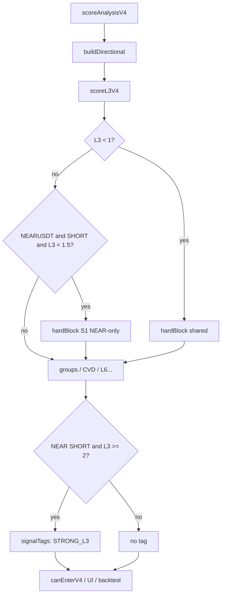

# REPORT — Kiến trúc NEAR-only SHORT L3≥1.5 (hard) + nhãn L3≥2

**Date:** 2026-08-02  
**Trạng thái:** Đề xuất kiến trúc — **chờ duyệt trước khi code**  
**Nguồn duyệt sản phẩm:** `REPORT_V4_NEAR_L1_L3_L6_OPTIMIZE_CVD220_2026-08-02.md` (S1 + S3)  
**Baseline CVD-rolling:** SHORT n=209 → sau S1 kỳ vọng ~n=128, WR ~75.0% (OOS ~76.5%)

---

## 1. Mục tiêu hành vi

| Rule | Side | Symbol | Hành vi |
|---|---|---|---|
| **S1 hard** | SHORT | `NEARUSDT` only | `L3 < 1.5` → **hard block** (không `canEnter`) |
| **S3 label** | SHORT | `NEARUSDT` only | `L3 ≥ 2` → nhãn **"tín hiệu mạnh"** — **không** chặn thêm |
| LONG | mọi | mọi (kể cả NEAR) | Giữ nguyên |
| SHORT | BTC / SOL / BNB | — | Giữ floor L3 shared hiện tại (`L3 < 1` mới hard) |

**Hiện trạng shared** (`services/scorerV4.ts` ~1176): `l3.score < 1` → hard block mọi symbol/side.  
**S1** = nâng floor **chỉ NEAR SHORT** từ `1` → `1.5` (post-score), không sửa công thức `scoreL3V4`.

---

## 2. Nguyên tắc thiết kế

1. **Post-score gate** — không sửa `scoreL3V4` / `FUNDING_STATE_*` / group mins trong `constants/scoring.ts`.
2. Điều kiện bắt buộc **`symbol === 'NEARUSDT' && direction === 'SHORT'`**.
3. Gate ghi vào **`hardBlocks`** để `canEnterV4`, `suggestDirectionV4`, Signal Board, trade plan, và backtest (`scoreAnalysisV4`) **cùng một nguồn**.
4. Label **không** đổi `decision` / không thêm hard block.
5. **Không** đụng LONG (thiếu mẫu + L6 ngược hướng đã xác nhận).

---

## 3. Kiến trúc khuyến nghị — Option A

### 3.1 Config SSOT (NEAR-scoped, file riêng)

Đề xuất file mới: `config/nearV4LayerGates.ts`  
(**Không** nhét số vào `constants/scoring.ts` — tránh nhầm shared.)

```ts
export const NEAR_V4_LAYER_GATES = {
  symbol: 'NEARUSDT' as const,
  SHORT: {
    /** S1 — hard min L3 raw score */
    l3MinHard: 1.5,
    /** S3 — badge only, không block */
    l3StrongLabelAt: 2,
  },
  // LONG: cố ý không khai báo min — chưa đủ dữ liệu
} as const;
```

Helpers thuần (cùng file hoặc cạnh file):

| Helper | Vai trò |
|---|---|
| `isNearShortLayerGateSymbol(symbol)` | `symbol === NEAR_V4_LAYER_GATES.symbol` |
| `nearShortL3HardBlockReason(l3Score)` | `string \| null` khi `l3Score < l3MinHard` |
| `nearShortL3IsStrong(l3Score)` | `true` khi `l3Score >= l3StrongLabelAt` |

Có thể thêm mirror pattern flag giống `CONTINUOUS_SCORING_TR_SYMBOLS` nếu muốn bật/tắt runtime — **không bắt buộc** cho MVP (gate luôn on cho NEAR sau merge).

### 3.2 Điểm gắn engine (một chỗ)

Trong `scoreAnalysisV4` → `buildDirectional`, **sau** `scoreL3V4`, cạnh hard L3 hiện có:

```text
if (l3.score < 1)
  → hardBlocks  // GIỮ NGUYÊN — mọi symbol / mọi side

else if (
  input.symbol === 'NEARUSDT'
  && direction === 'SHORT'
  && l3.score < 1.5
)
  → hardBlocks.push('NEAR SHORT — L3 MACD < 1.5 (gate NEAR-only)')
  // S1 MỚI — chỉ NEAR SHORT
```

- `input.symbol` đã có sẵn — không đổi chữ ký `scoreAnalysisV4`.
- Logic tách vào helper `applyNearShortL3HardGate(...)` để unit-test không mock cả scorer.
- Hệ quả: NEAR SHORT với L3 = 1.0 (trước có thể vào) → **bị chặn**; BTC SHORT L3 = 1.0 → **không đổi**.

### 3.3 Nhãn “tín hiệu mạnh” (S3)

**Khuyến nghị:** field tùy chọn trên `DirectionalScoreV4`:

```ts
/** NEAR SHORT only — UI badge; không ảnh hưởng canEnter */
signalTags?: ReadonlyArray<'STRONG_L3'>;
```

Set khi: `NEARUSDT` + `SHORT` + `l3.score >= 2`.  
UI (Signal Board / DecisionBadge / hàng L3): nếu có `STRONG_L3` → hiện **"tín hiệu mạnh"**.

**Không** map sang `SETUP_NGON` / không đổi `resolveDecision` (tránh lẫn ngưỡng điểm tổng).

Phương án nhẹ hơn (fallback): `warnings.push('NEAR SHORT — tín hiệu mạnh (L3≥2)')` khi không bị block. Nhược: dễ lẫn warning mềm. **Ưu tiên `signalTags`.**

### 3.4 Chuỗi gọi



---

## 4. Cố ý không đụng

| Không đụng | Lý do |
|---|---|
| Body `scoreL3V4` | Công thức shared mọi coin |
| `constants/scoring.ts` FUNDING / group mins | Rò BTC/SOL/BNB |
| Chữ ký `canEnterV4` | Gate đã nằm trong `hardBlocks` |
| NEAR LONG / gate L6 | Chưa đủ mẫu; L6 ngược hướng |
| Path V4.1 breakout | Ngoài phạm vi V4 scoring entry này |

---

## 5. Live ↔ backtest parity

Backtest `scripts/backtest-v4-near-90d.ts` gọi `scoreAnalysisV4` → sau khi gắn S1 trong engine, BT **tự nhận** gate (không cần filter CSV riêng).  
Sau khi implement (bước sau duyệt): rerun 180d CVD-rolling — kỳ vọng SHORT gần filter `l3 ≥ 1.5` (n≈128, WR≈75%); LONG không bị nâng floor L3.

---

## 6. Tests bắt buộc (khi được phép code)

| Case | Kỳ vọng |
|---|---|
| NEAR + SHORT + L3 = 1.0 | Hard block S1; `canEnter = false` |
| NEAR + SHORT + L3 = 1.5 | Không block S1 (block khác giữ nguyên) |
| NEAR + SHORT + L3 = 2.0 | Không block S1; `signalTags` chứa `STRONG_L3` |
| NEAR + LONG + L3 = 1.0 | **Không** S1 (chỉ rule shared `L3 < 1`) |
| BTC / SOL / BNB + SHORT + L3 = 1.0 | **Không** S1 |

---

## 7. Phương án thay thế — không khuyến nghị làm chính

| Option | Ý | Nhược |
|---|---|---|
| **B** — bọc `canEnterV4(active, { symbol })` | Ít đụng `buildDirectional` | UI / `suggestDirection` có thể vẫn “VAO” trong khi `canEnter` false → lệch |
| **C** — filter chỉ Signal Board | Nhanh | Backtest / journal / plan không đồng bộ |
| **D** — sửa `scoreL3V4` theo symbol | “Gọn” | Nhét symbol vào layer shared — dễ leak |

→ **Giữ Option A.**

---

## 8. Checklist duyệt kiến trúc

| # | Câu hỏi | Đề xuất |
|---|---|---|
| 1 | Config nằm đâu? | `config/nearV4LayerGates.ts` — **không** shared scoring constants |
| 2 | Gate gắn ở đâu? | `buildDirectional` sau L3 → `hardBlocks` |
| 3 | Label gắn đâu? | `signalTags: ['STRONG_L3']` + UI |
| 4 | LONG / coin khác? | Không đụng |
| 5 | Có sửa `scoreL3V4`? | **Không** |
| 6 | Soft vs hard S1? | **Hard** (đã duyệt sản phẩm S1) |

---

## 9. Bước tiếp theo (sau khi duyệt)

1. Implement Option A + unit tests (mục 6).  
2. Wire UI nhãn “tín hiệu mạnh” tối thiểu nơi Signal Board / decision hiển thị L3.  
3. Rerun BT 180d CVD-rolling — báo cáo n/WR SHORT vs kỳ vọng S1.  
4. **Không** mở gate LONG / L6 trong cùng PR.

---

**Chờ duyệt kiến trúc trước khi sửa bất kỳ file production nào.**
