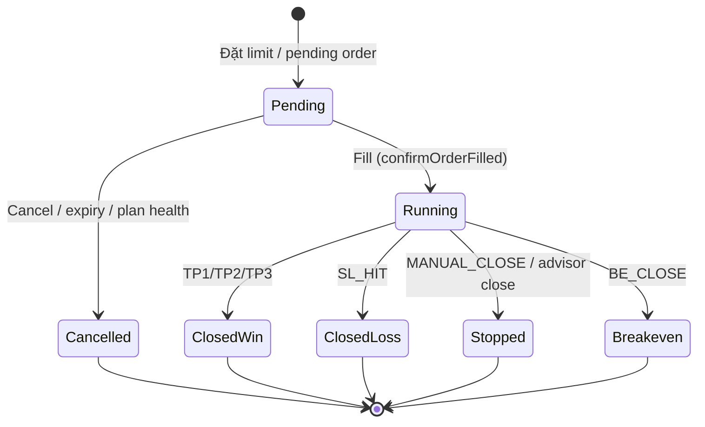

========================================================

TradeScore RuleBook V2

Status : LOCKED
Version : V2.0.0
Engine Target : TradeScore V1.0.5
Date : 2026-07-11

Mọi thay đổi Rule sau thời điểm này phải tạo RuleBook V2.x hoặc V3.
Không chỉnh trực tiếp RuleBook V2.

========================================================

**Phạm vi:** Tài liệu đặc tả — **không thay đổi hành vi runtime hiện tại**  
**Cập nhật cuối:** Task 01.2 — Event Log & Audit Replay (2026-07-11)

---

## Mục lục

| Phần | Mục | Nội dung |
|------|-----|----------|
| A | 1–9 | Entry State Manager (ESM) |
| A | 10–12 | Ghi chú, versioning, tham chiếu |
| B | 13–22 | Trade Journal V2 |
| C | 23–31 | Audit & Snapshot (Task 01.1) |
| **D** | **32–40** | **Event Log & Audit Replay (Task 01.2) — FINAL** |

---

## Mục đích

RuleBook V2 định nghĩa **Entry State Manager (ESM)** — tầng trạng thái vào lệnh chuẩn hóa, nằm **sau Rule Engine** và **trước Entry Engine**.

ESM không thay thế Scorer, Hard Block, Trade Plan hay Locked Plan hiện có. ESM **chuẩn hóa, ghi nhận và ổn định** quyết định vào lệnh để:

- Giảm nhiễu do quét 60s
- Khóa setup khi giá tiến gần entry
- Xuất audit nhất quán cho AI review

> **Nguyên tắc bảo toàn:** Mọi hành vi scoring, hard block, trade plan, locked plan, V4.1 visibility **giữ nguyên** cho đến khi có task triển khai ESM riêng. Tài liệu này mô tả chuẩn mục tiêu và map sang code hiện tại.

---

## Map sang hệ thống hiện tại (V1.0.5)

| RuleBook V2 | Khái niệm / enum hiện có | Ghi chú |
|-------------|---------------------------|---------|
| **READY** | `FinalEntryStatus.ENTRY_VALID` + `canEnter === true` | Signal Board V4 |
| **WATCH** | `WAIT_ENTRY`, `CHO_THEM`, V4.1 `WATCH_MODE`, Unified `WATCH` | Chờ điều kiện / giá |
| **LOCKED** | `LockedTradePlan.status === 'WAITING'` | Limit order đã khóa score |
| **BLOCKED** | `HARD_BLOCKED`, `GROUP_BLOCKED`, `SCORE_BLOCKED`, `canEnter === false` | Không được vào |

Các field audit mới (mục 7) **chưa có trong export** — chỉ đặc tả cho task sau.

---

## 1. Định nghĩa các trạng thái

### 1.1 READY — Sẵn sàng vào lệnh

**Ý nghĩa:** Setup đạt ngưỡng, plan hợp lệ, không bị hard/group/score block. User **được phép** mở lệnh theo hướng đã chọn.

**Điều kiện VÀO READY** (tất cả phải đúng sau Rule Engine):

| # | Điều kiện | Nguồn hiện tại |
|---|-----------|----------------|
| 1 | `hardBlocks.length === 0` (hướng active) | `scorerV4.ts` / `scorerV3.ts` |
| 2 | `groupBlocks.length === 0` | Scorer V3/V4 |
| 3 | `blockReasons.length === 0` (V4) | `scoreL5aV4`, v.v. |
| 4 | `decision` ∉ `{KHONG_VAO, CHO_THEM, CHO_TAI_CHAM}` | `SCORE_THRESHOLDS` |
| 5 | `tradePlan.tradePlanValid === true` | `tradePlanV3/V4` |
| 6 | `adxGate.block !== true` | `adxGate.ts` |
| 7 | `isAmbiguousDirection !== true` (sau hysteresis 2-scan) | `directionAmbiguity.ts` |
| 8 | `awaitingRescore !== true` (trừ bypass L9-only đã có) | `scorerV4.ts` |

**Điều kiện THOÁT READY:**

- Bất kỳ điều kiện trên fail → chuyển WATCH hoặc BLOCKED (tùy mức)
- Giá tiến vào vùng entry lock → **LOCKED** (ưu tiên cao hơn READY)
- User đặt pending limit → hệ thống journal chuyển sang PENDING (ngoài ESM symbol state)

**Chuyển trạng thái được phép:**

| Từ READY | Được | Không được |
|----------|------|------------|
| → WATCH | ✅ | |
| → LOCKED | ✅ | |
| → BLOCKED | ✅ | |
| → READY | ✅ (giữ) | |

**Hành vi V1.0.5 tương đương:** `FinalEntryStatus.ENTRY_VALID`, badge xanh, nút vào lệnh enabled (trừ manual override / unified bypass — ghi chú task sau).

---

### 1.2 WATCH — Theo dõi

**Ý nghĩa:** Setup **đáng chú ý** nhưng **chưa đủ điều kiện vào lệnh ngay**. Cần theo dõi thêm: giá về entry, điểm cải thiện, plan R:R, hoặc V4.1 momentum/EQ.

**Điều kiện VÀO WATCH** (một trong các nhóm):

| Nhóm | Điều kiện | Map hiện tại |
|------|-----------|--------------|
| A — Chờ giá/plan | Score đạt nhưng `tradePlanValid === false` hoặc R:R < min | `WAIT_ENTRY` |
| B — Điểm borderline | `decision === CHO_THEM` hoặc `CO_THE_VAO` nhưng chưa đủ canEnter | Scorer |
| C — V4.1 giám sát | `visibilityMode === WATCH_MODE` | `visibilityManager.ts` |
| D — Unified quan sát | `strength === WATCH` hoặc `MEDIUM` (V4 ok, V4.1 chưa) | `unifiedSignalEngine.ts` |
| E — Hướng sắp rõ | `consecutiveAmbiguousCount === 1` (chưa đủ 2 để AMBIGUOUS) | `directionAmbiguity.ts` |

**Điều kiện THOÁT WATCH:**

- Đủ điều kiện READY → READY (sau hysteresis nếu cấu hình)
- Vi phạm hard/group/score → BLOCKED
- Giá vào vùng lock → LOCKED

**Chuyển trạng thái được phép:**

| Từ WATCH | Được | Không được |
|----------|------|------------|
| → READY | ✅ | |
| → LOCKED | ✅ | |
| → BLOCKED | ✅ | |
| → WATCH | ✅ (giữ) | |

**Không được:** WATCH → READY **ngay sau 1 scan** nếu trước đó vừa từ READY xuống WATCH do nhiễu ngắn hạn (xem mục 3).

---

### 1.3 LOCKED — Khóa trạng thái

**Ý nghĩa:** Setup **đã cam kết** — score và các layer cốt lõi **đóng băng**. Chỉ live-rescore layer phụ (L2, L5–L10). Mục tiêu: tránh đổi ý khi giá đã tiến sát entry.

**Điều kiện VÀO LOCKED:**

| # | Điều kiện |
|---|-----------|
| 1 | Trước đó ∈ `{READY, WATCH}` |
| 2 | Giá market nằm trong **Entry Lock Zone** (xem mục 4) |
| 3 | Không có Hard Block Critical/High active |
| 4 | Hướng LONG/SHORT đã xác định (`AMBIGUOUS` không được lock) |

**Map hiện tại:** `LockedTradePlan` (`status: WAITING`) — frozen L1/L3/L4 trong `lockedPlanScoring.ts`.

**Điều kiện THOÁT LOCKED** (chỉ các lý do sau — **không** hủy vì nhiễu ngắn hạn):

| Lý do | Map hiện tại |
|-------|--------------|
| Hard Block Critical/High mới | `shouldCancelLockedPlan` + hard blocks |
| Xu hướng chính bị phá | CVD reversal lớn, BTC dump, price through SL |
| Whale Exit | *(chưa wired — ghi chú task sau)* |
| Risk Critical | Plan health CRITICAL, `PLAN_HEALTH_CANCEL` |
| User manual / expiry | `USER_MANUAL`, `PLAN_EXPIRED`, `SESSION_EXPIRED` |
| Fill / trigger | `TRIGGERED` → journal PENDING/OPEN |

**Chuyển trạng thái được phép:**

| Từ LOCKED | Được | Không được |
|-----------|------|------------|
| → BLOCKED | ✅ | |
| → READY | ✅ (sau unlock có điều kiện) | |
| → WATCH | ✅ (sau unlock mềm) | |
| → LOCKED | ✅ (giữ) | |
| → LOCKED → READY **do 1 scan MACD/RSI nhiễu** | | ❌ |

---

### 1.4 BLOCKED — Không được vào lệnh

**Ý nghĩa:** **Cấm** mở lệnh mới theo hướng setup. UI hiển thị lý do block.

**Điều kiện VÀO BLOCKED** (ưu tiên theo thứ tự — map `calculateFinalEntryStatus`):

| Ưu tiên | Điều kiện | `FinalEntryStatus` |
|---------|-----------|-------------------|
| 1 | `hardBlocks.length > 0` hoặc ADX CHOPPY block | `HARD_BLOCKED` |
| 2 | `groupBlocks.length > 0` | `GROUP_BLOCKED` |
| 3 | `decision` ∈ `{KHONG_VAO, CHO_THEM, CHO_TAI_CHAM}` | `SCORE_BLOCKED` |
| 4 | `isAmbiguousDirection === true` (sau 2-scan) | canEnter false |
| 5 | V4.1 Early Warning `severity === BLOCK` | `WATCH_MODE` force |

**Điều kiện THOÁT BLOCKED:**

- Nguyên nhân block **hết hiệu lực** liên tiếp đủ số scan (hysteresis thoát — mục 3)
- Chỉ còn soft condition → WATCH hoặc READY

**Chuyển trạng thái được phép:**

| Từ BLOCKED | Được | Không được |
|------------|------|------------|
| → WATCH | ✅ | |
| → READY | ✅ (sau xác nhận) | |
| → LOCKED | ✅ (hiếm: unlock block rồi giá vào zone) | |
| → BLOCKED | ✅ (giữ) | |
| → READY **ngay 1 scan** sau hard block vừa hết | | ❌ (cần hysteresis) |

---

## 2. Quy tắc chuyển trạng thái

### 2.1 Ma trận chuyển đổi hợp lệ

```
                    ┌─────────┐
         ┌─────────►│ BLOCKED │◄────────┐
         │          └────┬────┘         │
         │               │              │
    hard/group/score      │         hard critical
         │               │              │
    ┌────▼────┐    ┌─────▼─────┐   ┌────┴────┐
    │  WATCH  │◄──►│   READY   │──►│ LOCKED  │
    └──────────┘    └───────────┘   └─────────┘
         ▲               │               │
         │               │               │
         └───────────────┴───────────────┘
              price leaves lock zone /
              cancel / expiry / fill
```

### 2.2 Chi tiết từng quy tắc

| Transition | Điều kiện | Lý do thiết kế |
|------------|-----------|----------------|
| **READY → WATCH** | `tradePlanValid` false; score borderline; V4.1 EQ/momentum fail | Không ép vào khi plan chưa sẵn sàng |
| **READY → LOCKED** | Giá ∈ Entry Lock Zone | Cam kết setup khi sắp khớp entry |
| **READY → BLOCKED** | Hard/Group block mới; ADX CHOPPY; ambiguity confirmed | An toàn tuyệt đối |
| **WATCH → READY** | Đủ canEnter + plan valid + hysteresis enter (mục 3) | Tránh flip-flop |
| **WATCH → BLOCKED** | Hard block; score < ngưỡng; ambiguity 2-scan | Chặn setup xấu |
| **WATCH → LOCKED** | Giá vào lock zone từ WATCH | User đã theo dõi, giá tới |
| **LOCKED → BLOCKED** | Cancel reason critical (SL, BTC, CVD, funding, health) | Chỉ thoát lock khi rủi ro thật |
| **LOCKED → READY** | Unlock + đủ điều kiện READY (sau fill hoặc cancel mềm) | Tiếp tục flow bình thường |
| **LOCKED → WATCH** | Unlock không critical; giá ra khỏi lock zone | Quay lại theo dõi |
| **BLOCKED → WATCH** | Hard block hết; còn soft (plan/score) | Phân tầng block |
| **BLOCKED → READY** | Tất cả block hết + hysteresis exit (mục 3) | Xác nhận ổn định |
| **BLOCKED → LOCKED** | *(hiếm)* Block hết + giá đã trong lock zone | Edge case recovery |

### 2.3 Quy tắc cấm (global)

1. **Không** READY ↔ BLOCKED **trực tiếp** trong cùng 1 scan nếu có hysteresis active cho symbol đó.
2. **Không** LOCKED → WATCH chỉ vì 1 lần RSI/MACD dao động (layer live có thể cảnh báo, không unlock).
3. **Không** downgrade BLOCKED → READY khi `hardBlocks` vẫn còn trong snapshot (kể cả UI suppress MACD).
4. **Không** LOCK khi `AMBIGUOUS` — phải CLEAR hướng trước.

---

## 3. Quy tắc chống nhiễu (Hysteresis)

### 3.1 Nguyên tắc

- Một lần quét 60s **không đủ** để đổi trạng thái quan trọng (READY↔WATCH, BLOCKED↔READY).
- Mọi ngưỡng `N` **phải configurable** sau này (ESM config), không hardcode trong ESM logic ngoài default.

### 3.2 Tham số mặc định đề xuất

| Key | Default | Mô tả | Tiền lệ trong app |
|-----|---------|-------|-------------------|
| `hysteresis.enterReadyScans` | `2` | Số scan liên tiếp đủ điều kiện READY | `directionAmbiguity` 2-scan |
| `hysteresis.exitReadyScans` | `2` | Số scan liên tiếp fail trước khi READY→WATCH | Tương tự ambiguity exit |
| `hysteresis.enterBlockedScans` | `1` | Vào BLOCKED — **ngay** khi hard block | Hard block hiện tại instant |
| `hysteresis.exitBlockedScans` | `2` | Thoát BLOCKED sau hard block hết | Đề xuất mới |
| `hysteresis.ambiguityEnterScans` | `2` | LONG/SHORT sát nhau | `AMBIGUOUS_THRESHOLD` + 2 scan |
| `hysteresis.ambiguityExitScans` | `2` | Thoát AMBIGUOUS | `directionAmbiguity.ts` |
| `hysteresis.visibilityGap` | *(V4.1)* | Vùng giữ mode cũ | `visibilityManager.ts` Bước 4 |

### 3.3 Quy tắc READY ↔ WATCH

```
Scan t:   điều kiện READY fail (plan invalid)
Scan t+1: vẫn fail
→ READY → WATCH (sau exitReadyScans = 2)

Scan t:   fail 1 lần
Scan t+1: OK
→ GIỮ READY (không chuyển)
```

### 3.4 Quy tắc BLOCKED ↔ READY/WATCH

- **Hard Block Critical/High:** vào BLOCKED **ngay** (`enterBlockedScans = 1`).
- **Thoát BLOCKED:** cần `exitBlockedScans` liên tiếp không còn hard block.
- **Soft block** (group/score): có thể WATCH ngay, READY cần thêm `enterReadyScans`.

### 3.5 Counter lưu trữ (per symbol, per direction)

ESM duy trì:

- `consecutiveReadyCount`
- `consecutiveWatchCount`
- `consecutiveBlockedCount`
- `consecutiveClearDirectionCount` *(reuse ambiguity pattern)*

> **Ghi chú triển khai:** Counter **không** thay thế store hiện có (`useV41Store`, `ambiguityStateRef`, `LockedTradePlan`). ESM đọc/ghi metadata riêng hoặc wrap store — task sau.

---

## 4. Quy tắc Setup Lock

### 4.1 Entry Lock Zone

**Định nghĩa:** Vùng giá quanh `entryZone.optimal` mà khi market price đi vào, setup **phải LOCKED**.

| Tham số | Đề xuất default | Nguồn tham khảo |
|---------|-----------------|-----------------|
| `lockZone.mode` | `PERCENT` hoặc `ATR` | `calculateOptimalEntry` |
| `lockZone.percent` | `0.5%` | Entry buffer cap trong capital rules |
| `lockZone.atrMultiplier` | `0.25` | VWAP/entry buffer |
| `lockZone.minDistance` | Không lock nếu giá cách entry > X | Tránh lock quá sớm |

**Công thức (PERCENT):**

```
lockLow  = optimalEntry × (1 - lockZone.percent)
lockHigh = optimalEntry × (1 + lockZone.percent)
LOCKED khi: lockLow ≤ markPrice ≤ lockHigh
```

### 4.2 Hành vi khi LOCKED

| Hạng mục | Frozen | Live (rescore) |
|----------|--------|----------------|
| Layer 1, 3, 4 | ✅ | ❌ |
| Layer 2, 5, 6, 7, 8, 9, 10 | ❌ | ✅ |
| `lockedScore` | ✅ | ❌ |
| `lockedDirection` | ✅ | ❌ |
| SL/TP prices | ✅ (trừ structure invalidation) | Monitor only |

*Map hiện tại:* `FROZEN_LAYER_NUMBERS = [1,3,4]`, `LIVE_LAYER_NUMBERS = [2,5,6,7,8,9,10]` trong `lockedPlanScoring.ts`.

### 4.3 Điều kiện HỦY LOCK (unlock → BLOCKED hoặc WATCH)

| # | Lý do | Priority | Map `CancelReason` |
|---|-------|----------|-------------------|
| 1 | Hard Block Critical mới | Critical | hard blocks + ADX |
| 2 | Giá xuyên SL | Critical | `PRICE_THROUGH_SL` |
| 3 | BTC extreme / directional | High | `BTC_DUMP` |
| 4 | Funding extreme squeeze | High | `FUNDING_EXTREME` |
| 5 | CVD reversal lớn (≥200K delta hoặc flip) | High | `CVD_REVERSAL` |
| 6 | Plan health CRITICAL (≥3 penalty) | High | `PLAN_HEALTH_CANCEL` |
| 7 | Xu hướng chính bị phá (structure BOS ngược) | High | *(task sau — structure gate)* |
| 8 | Whale Exit (wall biến mất / delta đảo) | High | *(task sau — whale engine)* |
| 9 | Plan / session expiry | Medium | `PLAN_EXPIRED`, `SESSION_EXPIRED` |
| 10 | User manual | Low | `USER_MANUAL` |

### 4.4 Điều kiện KHÔNG được hủy lock

- 1 scan MACD histogram đảo
- 1 scan RSI lệch sweet zone
- Funding elevated (chưa extreme)
- L5a soft warning (`blockReasons` không phải hard)
- VWAP bonus mất 0.5đ
- Score dao động < 1đ trong LIVE layers

---

## 5. Commit Score

### 5.1 Định nghĩa

**Commit Score** là chỉ số **metadata** đo *mức độ nên giữ nguyên quyết định setup đã tạo* sau khi đã LOCKED hoặc READY.

| Thuộc tính | Giá trị |
|------------|--------|
| Phạm vi | `0` – `100` |
| Ý nghĩa cao | Setup ổn định, ít lý do đổi ý |
| Ý nghĩa thấp | Nhiều layer live đang xấu đi, nhưng chưa đủ hủy lock |

### 5.2 Commit Score ≠ Entry Score

| | Entry Score | Commit Score |
|---|-------------|--------------|
| **Đo cái gì** | Chất lượng vào lệnh **lúc đánh giá** | Độ **bền** của quyết định đã cam kết |
| **Nguồn** | `officialTotalScore` / `totalScore` (V4/V3) | ESM tổng hợp từ snapshot đã lock |
| **Dùng để vào lệnh?** | ✅ (ngưỡng ≥9, decision band) | ❌ **Không** |
| **V1.0.5** | Đã có | **Chưa có** — chỉ metadata tương lai |

### 5.3 Công thức đề xuất (chỉ tài liệu)

```
commitScore = 100
  - penaltyLiveLayerDrift    (L2,L5-L10 vs lúc lock, weighted)
  - penaltyPlanHealth        (0–40 theo health score)
  - penaltyDistanceFromEntry (giá xa optimal sau khi lock)
  - penaltyTimeInLock        (decay nhẹ sau expiry tier)
```

### 5.4 Vai trò hiện tại

- **Chỉ ghi vào audit export** (mục 7)
- **Không** tham gia `canEnter`, `calculateFinalEntryStatus`, `makeDecision`
- **Không** thay `lockedScore`

---

## 6. Phân cấp Hard Block

> **Lưu ý:** Phân loại **không thay đổi** logic hard block V1.0.5. Chỉ taxonomy cho ESM và audit mở rộng.

### 6.1 Critical

Chặn ngay; hủy LOCKED nếu đang lock.

| ID | Mô tả | Nguồn |
|----|-------|-------|
| `HB-CRIT-01` | ADX CHOPPY cả 1H+4H | `adxGate.ts` |
| `HB-CRIT-02` | Giá xuyên SL (locked plan) | `shouldCancelLockedPlan` |
| `HB-CRIT-03` | BTC ±8% extreme | `scoreL8V4`, `HARD_BLOCK_RULES_V4` |
| `HB-CRIT-04` | Plan health CRITICAL + auto-cancel | `planHealth.ts` |

### 6.2 High

Chặn vào lệnh; hủy LOCKED.

| ID | Mô tả | Nguồn |
|----|-------|-------|
| `HB-HIGH-01` | CVD LONG hard block (STRONG_BEARISH + price < EMA20) | `evaluateLongCvdHardBlock` |
| `HB-HIGH-02` | CVD SHORT > +2M | `scoreL5aV4` |
| `HB-HIGH-03` | BTC directional ±2% | `scoreL8V4` |
| `HB-HIGH-04` | Funding squeeze ±0.03% | `scoreL6V4` |
| `HB-HIGH-05` | L3 MACD vi phạm (score < 1) | `scoreL3V4` |
| `HB-HIGH-06` | CVD reversal cancel (locked) | `CVD_REVERSAL` |

### 6.3 Medium

Chặn canEnter; có thể chỉ WATCH khi thoát dần.

| ID | Mô tả | Nguồn |
|----|-------|-------|
| `HB-MED-01` | Group block A/B/C | `groupBlocks[]` |
| `HB-MED-02` | L9 phiên xấu (session score < 0.5) | `scoreL9V4` |
| `HB-MED-03` | L10 tâm lý < 1 | `scoreL10V4` |
| `HB-MED-04` | Direction AMBIGUOUS (2-scan) | `directionAmbiguity.ts` |
| `HB-MED-05` | V4.1 Early Warning BLOCK | `earlyWarningEngine.ts` |

### 6.4 Low

Cảnh báo hoặc soft block; **không** hard block array.

| ID | Mô tả | Nguồn |
|----|-------|-------|
| `HB-LOW-01` | L5a soft (`blockReasons`, CVD chưa đủ 1đ) | `scoreL5aV4` |
| `HB-LOW-02` | L/S ratio extreme warning | L7 warning |
| `HB-LOW-03` | Squeeze warning (ENTRY_VALID) | `squeezeWarning` |
| `HB-LOW-04` | Recovering CVD penalty −1đ | `applyRecoveringCvdLocalPenalty` |

### 6.5 Map ưu tiên → ESM

```
if any Critical active  → BLOCKED (instant)
else if any High active → BLOCKED (instant)
else if any Medium      → BLOCKED or WATCH (config)
else if any Low         → WATCH (không BLOCKED unless combined)
```

---

## 7. Chuẩn Audit Export

Các trường **mới** cho gói audit (CSV / TXT / AI package). **Chưa implement** — mô tả schema.

### 7.1 Trường bắt buộc

| Field | Type | Mô tả | Ví dụ |
|-------|------|-------|-------|
| `entry_state` | enum | Trạng thái ESM hiện tại | `READY` |
| `previous_state` | enum | Trạng thái scan trước | `WATCH` |
| `transition` | string | `PREVIOUS → CURRENT` | `WATCH → READY` |
| `transition_reason` | string | Lý do chuyển (human) | `Plan valid + 2 scan confirm` |
| `commit_score` | number \| null | 0–100 metadata | `82` |
| `lock_status` | enum | `UNLOCKED` \| `LOCKED` \| `PENDING_FILL` | `LOCKED` |
| `lock_reason` | string \| null | Lý do vào lock | `Price in entry lock zone` |
| `hard_block_priority` | enum \| null | `CRITICAL` \| `HIGH` \| `MEDIUM` \| `LOW` \| null | `HIGH` |
| `consecutive_scan_count` | number | Counter hysteresis active | `2` |
| `rule_version` | string | RuleBook version | `RuleBook V2.0` |
| `audit_version` | string | Schema export | `audit-v2.0` |
| `timestamp` | ISO8601 | Thời điểm snapshot | `2026-07-11T08:30:00Z` |

### 7.2 Trường bổ sung khuyến nghị

| Field | Mô tả |
|-------|-------|
| `symbol` | Cặp giao dịch |
| `direction` | `LONG` \| `SHORT` |
| `scorer_version` | `v3` \| `v4` \| `v41` \| `unified` |
| `entry_score` | `officialTotalScore` — **không** nhầm commit score |
| `hard_blocks` | Danh sách raw (giữ export hiện tại) |
| `hysteresis_config` | Snapshot config đang dùng |
| `lock_zone_bounds` | `{ low, high, optimal }` |

### 7.3 Vị trí trong gói export

```
Section: ENTRY STATE (ESM)
  entry_state: READY
  previous_state: WATCH
  transition: WATCH → READY
  ...
```

*Tích hợp vào:* `exportService.ts`, `exportEntrySltpAuditPackage.ts` — **task riêng, không thuộc Task 01**.

---

## 8. Ràng buộc kiến trúc

### 8.1 Entry State Manager KHÔNG được sửa

| Module | Lý do |
|--------|-------|
| Score Engine (`scorerV3`, `scorerV4`) | Single responsibility scoring |
| Rule Engine (hard block, group, decision) | Đã có trong scorer + `finalEntryStatus` |
| CVD Engine (`indicators.analyzeCVD`) | Tính toán indicator |
| Position Adviser (`positionAdvisorV3/V4/V41`) | Quản lý lệnh mở |
| Whale Engine (`whaleConfirmation`) | Xác nhận wall |
| STL / Structure SL (`structureSL.ts`) | SL theo swing |
| TradePlan (`tradePlanV3/V4`) | Entry/SL/TP geometry |

ESM **chỉ đọc output** từ các module trên.

### 8.2 Luồng xử lý chuẩn

```
Indicators
    ↓
Score Engine          (scorerV3 / scorerV4 / scanV41 snapshot)
    ↓
Rule Engine           (hardBlocks, groupBlocks, decision, ADX gate, plan validity)
    ↓
Entry State Manager   ← TẦNG MỚI (RuleBook V2)
    ↓
Entry Engine          (UI canEnter, pending limit, journal open)
    ↓
Trade Journal         (AiTradeJournalEntry, LockedTradePlan)
```

### 8.3 Điểm tích hợp đề xuất (task sau)

| Vị trí | Hành động |
|--------|-----------|
| `signalBoardScan.ts` | Sau `enrichSnapshotFinalStatus` → gọi ESM |
| `scanV41.ts` | Sau visibility/opportunity → merge ESM state |
| `scanUnified.ts` | Đọc ESM từ V4 + V41 |
| `useLockedPlanMonitor` | Đồng bộ LOCKED với `LockedTradePlan` |

---

## 9. Nguyên tắc thiết kế

### 9.1 Single Responsibility

- ESM **chỉ** quản lý state machine: READY / WATCH / LOCKED / BLOCKED.
- Không tính điểm layer, không build trade plan.

### 9.2 Single Source of Truth

- Một `EntryStateSnapshot` per `(symbol, direction)` per scan.
- UI, export, journal đọc từ snapshot này — không suy diễn riêng.

### 9.3 Không tính lại dữ liệu

ESM **cấm** gọi lại:

| Dữ liệu | Lấy từ |
|---------|--------|
| EMA20/50 | `getEMAAnalysisV3` output trên snapshot |
| CVD | `cvdPoints` / `analyzeCVD` result đã có |
| Momentum | `getBTCAnalysisV3.momentum`, `MomentumResult` V4.1 |
| MACD/RSI/ADX | Layer results / `ruleAuditSnapshot` |
| Hard blocks | `hardBlocks[]`, `adxGate` |

### 9.4 Idempotent per scan

- Cùng input snapshot → cùng `entry_state` (trừ counter hysteresis lưu state).

### 9.5 Backward compatible

- Khi ESM chưa bật: app chạy y như V1.0.5 (`FinalEntryStatus` only).
- Feature flag đề xuất: `ENTRY_STATE_MANAGER_ENABLED`.

---

## 10. Ghi chú phát hiện — cần task code (KHÔNG sửa trong Task 01)

| # | Phát hiện | Đề xuất task |
|---|-----------|--------------|
| 1 | `scanUnified.buildV41Row` thiếu `momentum` → unified gate luôn fail | Task wiring V4.1 |
| 2 | `hardBlocked` flag gộp `groupBlocks` — dễ nhầm Critical | Task snapshot cleanup |
| 3 | UI `SignalBoard` duplicate BTC hard check | Task UI single source |
| 4 | Whale Exit chưa có cancel reason trong locked plan | Task whale → ESM |
| 5 | `Commit Score` chưa tồn tại trong code | Task ESM metadata |
| 6 | Export chưa có section ENTRY STATE | Task audit v2 fields |

---

## 11. Versioning

| Artifact | Version |
|----------|---------|
| RuleBook | **V2.0** |
| Audit schema | **audit-v2.0** |
| App baseline | **TradeScore V1.0.5** |
| Rule engine reference | `TradeScore V4` (`tradeScoreRuleBook.ts`) |

Khi Rule Engine đổi → cập nhật `rule_version` trong export, **không** tự động đổi state machine semantics mà không bump RuleBook major version.

---

## 12. Tài liệu tham chiếu nội bộ

| File | Nội dung |
|------|----------|
| `docs/tradeScoreRuleBook.ts` | Layer rules V3/V4 (GĐ2 audit) |
| `docs/V3_V4_HARDLOCK_SOFTBLOCK_ENTRY_SL_REPORT.md` | Hard lock vs soft block |
| `docs/Production_Execution_Path_Audit_Report.txt` | Production execution paths |
| `services/finalEntryStatus.ts` | FinalEntryStatus enum |
| `services/directionAmbiguity.ts` | Hysteresis 2-scan |
| `services/lockedPlanScoring.ts` | Setup lock frozen/live layers |
| `services/v41/visibilityManager.ts` | V4.1 WATCH/TRADE hysteresis |
| `constants/scoring.ts` | `HARD_BLOCK_RULES_V4`, thresholds |
| `components/journal/JournalTradeTable.tsx` | Journal UI hiện tại (V1.0.5) |
| `constants/aiJournal.ts` | `AiTradeJournalEntry`, `StrategySource` |
| `hooks/useJournalMarketSync.ts` | Mark price + live advisor label |

---

## 13. Trade Journal V2 — Tổng quan

### 13.1 Mục tiêu

**Trade Journal V2** là **trung tâm duy nhất** quản lý toàn bộ vòng đời lệnh:

- Pending (chờ khớp)
- Running (đang mở)
- Closed (đã đóng / hủy)

**Không** xây dựng màn hình Active Trade riêng.  
**Không** xây dựng màn hình Pending Order riêng.  
Mọi trạng thái hiển thị và thao tác trong **một Journal thống nhất**.

| Nguyên tắc | Mô tả |
|------------|-------|
| Giao diện gọn | Một bảng / filter, không trùng panel |
| Chuyên nghiệp | Cột cố định theo lifecycle |
| Dễ hiểu | Status rõ: PENDING / RUNNING / CLOSED |
| Không trùng dữ liệu | Một `AiTradeJournalEntry` — SSOT |

### 13.2 Map trạng thái UI ↔ dữ liệu hiện tại (V1.0.5)

| Journal V2 (UI) | `outcome.status` | Ghi chú |
|-----------------|------------------|---------|
| **Pending Orders** | `PENDING` | Limit chưa fill |
| **Running Orders** | `OPEN` | Label UI: `RUNNING` |
| **Closed Orders** | `WIN`, `LOSS`, `BREAKEVEN`, `CANCELLED` | Filter “Closed” |

> **Ghi chú triển khai:** `ActiveTradesPanel` hiện tách OPEN+PENDING — V2 gộp vào `JournalScreen` + filter. Task UI riêng; **không sửa trong Task 01**.

### 13.3 Vị trí trong kiến trúc

```
Entry State Manager (mục 1–9)
        ↓
Entry Engine (mở lệnh / pending)
        ↓
Trade Journal V2  ← hiển thị + ghi nhận (mục 13–20)
        ↓
Persistence / Export / Insights
```

---

## 14. Pending Orders — Đặc tả hiển thị

Áp dụng khi `outcome.status === 'PENDING'`.

| # | Field (UI) | Nguồn dữ liệu (đọc only) | Ghi chú |
|---|------------|---------------------------|---------|
| 1 | **Source** | `scoring.scorerVersion`, `strategySource`, tag `v41` | V3 / V4 / CVDX / V4.1 / Unified |
| 2 | **Coin** | `symbol` + `scoring.direction` | VD: `NEAR LONG` |
| 3 | **Status** | `resolveJournalStatusLabel(entry)` | `PENDING`, stale warning |
| 4 | **Recommendation** | `scoring.recommendationLabel` | **Snapshot lúc tạo** — không tính lại |
| 5 | **Entry Price** | `outcome.limitOrderPrice` ?? `market.entryPrice` | Giá limit đặt |
| 6 | **Current Price** | `resolveJournalMarketPrice(entry, markBySymbol)` | **Giá market** — không dùng entry |
| 7 | **Open Reason** | `resolveJournalOpenReasonDisplay(entry)` | `plan.openReason` |
| 8 | **Create Time** | `outcome.limitOrderPlacedAt` ?? `timestamp` | Thời điểm đặt pending |
| 9 | **Fill Button** | Action → `confirmOrderFilled` | Khớp lệnh thủ công |
| 10 | **Stop/Cancel Button** | Action → `cancelPendingOrder` | Huỷ pending |
| 11 | **Detail Menu** | `JournalEntryDetail` | Full snapshot |

**Cột không hiển thị khi Pending:** Close Reason, PnL realized (chỉ `—`).

**Hành vi V1.0.5:** `JournalTradeTable` — Fill / Huỷ / `···` detail.

---

## 15. Running Orders — Đặc tả hiển thị

Áp dụng khi `outcome.status === 'OPEN'`.

| # | Field (UI) | Nguồn dữ liệu (đọc only) | Ghi chú |
|---|------------|---------------------------|---------|
| 1 | **Source** | `strategySource`, `scoring.scorerVersion` | V3 / V4 / CVDX |
| 2 | **Coin** | `symbol` + `scoring.direction` | |
| 3 | **Recommendation** | `scoring.recommendationLabel` | **Lúc mở** — frozen |
| 4 | **Entry** | `market.entryPrice` | Giá vào thực tế |
| 5 | **Current Price** | `resolveJournalMarketPrice` | Market live |
| 6 | **Unrealized PnL** | `buildJournalOpenPnlBreakdown` → `unrealizedPnl` / `totalPnl` | Partial close tách dòng |
| 7 | **Open Reason** | `resolveJournalOpenReasonDisplay` | |
| 8 | **Position Adviser V3 Recommendation** | `evaluatePositionV3` output *(task lưu snapshot)* | Chạy live hoặc đọc snapshot |
| 9 | **Position Adviser V4 Recommendation** | `evaluatePositionV4` output *(task lưu snapshot)* | Chạy live hoặc đọc snapshot |
| 10 | **Live Recommendation** | `advisorLabelById` từ `useJournalMarketSync` | **Một label** theo engine entry |
| 11 | **Stop Button** | Action → `closeTradeEntry` | Mở `CloseTradeModal` |
| 12 | **Detail Button** | `JournalEntryDetail` | |

### 15.1 Phân biệt Recommendation (V2)

| Loại | Thời điểm | Cập nhật? |
|------|-----------|-----------|
| Recommendation (cột chính) | Lúc mở lệnh | ❌ Frozen — `scoring.recommendationLabel` |
| PA V3 / PA V4 | Mỗi scan | ✅ Live từ adviser tương ứng |
| Live Recommendation | Mỗi scan | ✅ Label hiển thị chính trên UI running |

> V1.0.5 chỉ có **một** live advisor theo `resolveScorerVersionForEntry`. V2 spec yêu cầu **cả hai** PA V3+V4 lưu/hiển thị song song — **task snapshot sau**, không duplicate logic tính điểm.

---

## 16. Closed Orders — Đặc tả hiển thị

Áp dụng khi `outcome.status` ∈ `{ WIN, LOSS, BREAKEVEN, CANCELLED }`.

| # | Field (UI) | Nguồn dữ liệu | Ghi chú |
|---|------------|---------------|---------|
| 1 | **Source** | `strategySource`, `scoring.scorerVersion` | |
| 2 | **Coin** | `symbol` + `scoring.direction` | |
| 3 | **Recommendation khi mở** | `scoring.recommendationLabel` | Snapshot |
| 4 | **Recommendation khi đóng** | `positionAdvisorActionAtExit` + label | `buildCloseAdvisorContext` lúc đóng |
| 5 | **Entry** | `market.entryPrice` | |
| 6 | **Exit** | `outcome.exitPrice` | |
| 7 | **PnL** | `outcome.pnlUSDT`, `outcome.pnlPct` | Gồm partial đã realize |
| 8 | **Win/Loss** | `outcome.status` | WIN / LOSS / BREAKEVEN / CANCELLED |
| 9 | **Close Reason** | `resolveJournalCloseReasonDisplay` | |
| 10 | **Close Time** | `outcome.exitTimestamp` | |

**Cột Current Price:** không dùng — thay bằng **Exit**.

---

## 17. Recommendation Source — Quy tắc bắt buộc

### 17.1 Nguyên tắc

Trade Journal **KHÔNG** được:

- Tính Recommendation mới từ indicator
- Tính lại Score / layer
- Duplicate logic Position Adviser trong `journalService`

### 17.2 Nguồn hợp lệ duy nhất

| Loại | Module | Hàm / output |
|------|--------|--------------|
| Recommendation lúc vào | Scorer + UI lúc open | `scoring.recommendationLabel`, `scoring.score` |
| Live PA (running) | Position Adviser V3 | `evaluatePositionV3` / `buildCloseAdvisorContext` |
| Live PA (running) | Position Adviser V4 | `evaluatePositionV4` / `buildCloseAdvisorContext` |
| Live PA V4.1 | Position Adviser V41 | `evaluatePositionV41` *(entry v41)* |
| Recommendation lúc đóng | Close flow | `positionAdvisorActionAtExit` |

### 17.3 Luồng đọc (running)

```
useJournalMarketSync
  → markBySymbol (signalRows + v41Rows)     // giá only
  → buildCloseAdvisorContext               // PA label
  → enrichAdvisorLabelWithPartial          // hiển thị
  → advisorLabelById[id]                   // UI
```

Journal **chỉ bind** field đã tính — **không** gọi `scoreAnalysisV4` hay `analyzeCVD` trong component table.

---

## 18. Order Lifecycle — Vòng đời đầy đủ

Mọi nhánh **phải** ghi một bản ghi `AiTradeJournalEntry` (hoặc cập nhật cùng `id`).

### 18.1 Sơ đồ tổng



### 18.2 Các nhánh bắt buộc

| # | Luồng | `outcome.status` | `exitReason` (nếu có) |
|---|-------|------------------|------------------------|
| 1 | Pending → Running | `PENDING` → `OPEN` | — |
| 2 | Pending → Cancelled | `CANCELLED` | `LIMIT_NOT_FILLED`, `PLAN_EXPIRED`, … |
| 3 | Running → Stopped (manual) | `WIN`/`LOSS`/`BREAKEVEN` | `MANUAL_CLOSE` |
| 4 | Running → Take Profit | `WIN` | `TP1_HIT` / `TP2_HIT` / `TP3_HIT` |
| 5 | Running → Stop Loss | `LOSS` | `SL_HIT` |
| 6 | Running → Partial → Close | `OPEN` (partial) → closed | `PARTIAL_*` records |

### 18.3 Ghi nhận bắt buộc mỗi transition

| Sự kiện | Field cập nhật |
|---------|----------------|
| Tạo pending | `outcome.status=PENDING`, `limitOrderPrice`, `limitOrderPlacedAt` |
| Fill | `status=OPEN`, `market.entryPrice`, `fillMarketPrice` |
| Partial close | `partialCloses[]` |
| Close | `exitPrice`, `exitTimestamp`, `pnlUSDT`, `closeReason`, PA at exit |

**Không** tạo entry mới khi fill — **cùng `id`** từ pending → open.

---

## 19. Source Tracking — Thống kê theo hệ thống

### 19.1 Giá trị `strategySource` / scorer

| Source (UI) | `strategySource` | `scoring.scorerVersion` | Ghi chú |
|-------------|------------------|-------------------------|---------|
| **V3** | `V3` | `v3` | Scorer V3 |
| **V4** | `V4` | `v4` | Scorer V4 |
| **CVDX** | `CVDX` | `v4` | V4 + CVD recovering path |
| V4.1 | — | `v41` | Tag `v41` / `v41Snapshot` |
| Unified | — | `unified` | Tab tổng hợp |
| Manual | `MANUAL` | — | User override |

> User spec ghi **VCVDX** — trong codebase chuẩn là **`CVDX`** (`constants/aiJournal.ts`). Export thống kê dùng `CVDX`.

### 19.2 Metrics theo source (Insights — task sau)

Mỗi metric filter theo `strategySource` + `scorerVersion`:

| Metric | Công thức |
|--------|-----------|
| Win Rate | `WIN / (WIN + LOSS)` per source |
| Profit Factor | `grossProfit / grossLoss` |
| Average Profit | `mean(pnlUSDT)` wins |
| Average Holding Time | `mean(holdingTimeMinutes)` |
| Max Drawdown | Equity curve per source subset |

**Điều kiện:** chỉ entry có `strategySource` rõ — không suy luận sau khi ghi.

---

## 20. Rule Snapshot — Lưu tại thời điểm mở lệnh

### 20.1 Mục đích

Snapshot **chỉ phục vụ Audit** và so sánh “đã biết gì lúc vào”.  
**Không** dùng để rescore, không cập nhật khi running (trừ field live PA riêng mục 15).

### 20.2 Snapshot tối thiểu (bắt buộc V2)

> **Đặc tả đầy đủ:** xem **mục 25 — Open Snapshot** (Task 01.1).

| Field | Map hiện tại / ESM | Ghi chú |
|-------|-------------------|---------|
| **Entry Score** | `scoring.totalScore`, `scoring.score` | Không nhầm Commit Score |
| **Recommendation** | `scoring.recommendationLabel` | |
| **Trend** | `scoring.marketState`, SMC trend trong snapshot | |
| **CVD Status** | `market.cvdValue`, `market.cvdTrend` | |
| **Whale Status** | `structureSLSnapshot` / whale context *(mở rộng)* | Task bổ sung field |
| **Risk Status** | `plan.isSafeSL`, `adxSnapshot`, plan health | |
| **Hard Block Status** | `scoring.mandatoryViolations`, hard block flags at open | |
| **Commit Score** | ESM metadata *(mục 5)* | `null` until ESM ships |
| **Entry State** | ESM `entry_state` *(mục 7)* | `null` until ESM ships |

### 20.3 Snapshot structure đề xuất (JSON — task persist)

```json
{
  "capturedAt": "ISO8601",
  "entryScore": 10.2,
  "recommendation": "VÀO TỰ TIN 10.2/15",
  "trend": "BULLISH",
  "cvdStatus": { "value": -120000, "trend": "DOWN" },
  "whaleStatus": { "wallsNearEntry": 2, "confirmed": true },
  "riskStatus": { "safeSl": true, "adxRegime": "TRENDING" },
  "hardBlockStatus": { "blocked": false, "reasons": [] },
  "commitScore": null,
  "entryState": "READY",
  "ruleVersion": "RuleBook V2.0",
  "strategySource": "V4"
}
```

### 20.4 Quy tắc immutability

> **Nguyên tắc bắt buộc đầy đủ:** xem **mục 31 — Nguyên tắc Snapshot**.

- Snapshot **write-once** tại event: `confirmOrderFilled` hoặc `openPosition` immediate.
- Pending tạo **pre-open snapshot** (scoring at place) — frozen khi fill.
- **Cấm** merge snapshot mới vào entry đã OPEN khi rescan.

---

## 21. Architecture Constraint — Trade Journal

### 21.1 Trade Journal chỉ là tầng hiển thị + ghi nhận

| Được phép | Không được phép |
|-----------|-----------------|
| Đọc `AiTradeJournalEntry` | Tính EMA |
| Gọi PA qua hook/service có sẵn | Tính CVD |
| Format giá / PnL / label | Tính Score |
| Filter / paginate / export CSV | Duplicate Recommendation logic |
| Ghi outcome qua `useTradeStore` actions | Tự implement Position Adviser rules |

### 21.2 Module boundary

```
┌─────────────────────────────────────────┐
│  Trade Journal V2 (UI + persistence)    │
│  JournalScreen, JournalTradeTable,      │
│  journalService (format/display only)   │
└─────────────────┬───────────────────────┘
                  │ read / write entry
                  ▼
┌─────────────────────────────────────────┐
│  useTradeStore / aiTradeJournal         │
└─────────────────┬───────────────────────┘
                  │ consumes
                  ▼
  Score Engine │ Rule Engine │ PA V3/V4 │ ESM
```

### 21.3 Deprecation path (không làm trong Task 01)

| Component hiện tại | V2 |
|--------------------|-----|
| `ActiveTradesPanel` | Gộp filter Running+Pending trong Journal |
| Pending cards rời | Một bảng + status filter |
| Duplicate mark price logic | Chỉ `useJournalMarketSync` |

---

## 22. Cập nhật mục 10 — Ghi chú task code (bổ sung)

| # | Phát hiện | Đề xuất task |
|---|-----------|--------------|
| 7 | Journal chưa lưu PA V3+V4 song song trên running | Task journal PA snapshot |
| 8 | `Commit Score` / `Entry State` chưa trong open snapshot | Task ESM + journal persist |
| 9 | `ActiveTradesPanel` trùng Journal | Task UI merge Journal V2 |
| 10 | Whale status chưa field snapshot chuẩn | Task `whaleStatusAtEntry` |

---

# Phần C — Audit & Snapshot (Task 01.1)

> Mục tiêu: Đọc file Export là đủ để đánh giá hệ thống có chạy đúng Rule hay không.  
> **Chỉ tài liệu** — không implement trong Task 01.1.

---

## 23. Decision Timeline

### 23.1 Mục đích

**Decision Timeline** ghi lại **toàn bộ quá trình thay đổi quyết định ESM** *trước khi vào lệnh* (pre-entry).

Dùng để trả lời câu hỏi audit:

- Setup đã từng READY bao lâu trước khi LOCKED?
- Có bị BLOCKED rồi quay lại READY không? Sau mấy scan?
- Rule nào kích hoạt mỗi lần chuyển?

**Không** dùng để tính score, entry, hay PA. **Chỉ audit.**

### 23.2 Phạm vi thời gian

| Bao gồm | Không bao gồm |
|---------|---------------|
| ESM: WATCH → READY → LOCKED → ENTRY intent | RUNNING / TP / SL sau khi fill |
| Cùng `symbol` + `direction` + session setup | Scan không liên quan symbol |

**ENTRY** trong timeline = sự kiện user/engine **khởi tạo** pending hoặc market order — *trước* `outcome.status = OPEN`.

### 23.3 Ví dụ luồng

```
WATCH
  ↓  (scan 12→13: plan valid + hysteresis enterReadyScans=2)
READY
  ↓  (scan 14: price ∈ Entry Lock Zone)
LOCKED
  ↓  (scan 15: user places limit / market open)
ENTRY
```

### 23.4 Bản ghi bắt buộc mỗi transition

Mỗi phần tử trong `decisionTimeline[]`:

| Field | Type | Mô tả |
|-------|------|-------|
| `timestamp` | ISO8601 ms | Thời điểm scan ghi nhận |
| `previousState` | enum | `WATCH` \| `READY` \| `LOCKED` \| `BLOCKED` |
| `nextState` | enum | Trạng thái sau transition |
| `transitionReason` | string | Human-readable (VD: "Plan valid, 2-scan confirm") |
| `ruleTriggered` | string | Rule ID (VD: `ESM-READY-ENTER`, `ESM-LOCK-ZONE`) |
| `scanIndex` | number | Scan thứ bao nhiêu kể từ setup active (1-based) |
| `symbol` | string | `BTCUSDT`, … |
| `direction` | enum | `LONG` \| `SHORT` |
| `commitScore` | number \| null | Metadata tại scan (mục 5) |
| `hardBlockPriority` | enum \| null | Nếu liên quan BLOCKED |

### 23.5 Ví dụ export (TXT section)

```
=== DECISION TIMELINE ===
symbol: NEARUSDT | direction: LONG

[scan 11] 2026-07-11T08:10:00Z  WATCH → WATCH     | plan invalid (R:R 1.8)
[scan 12] 2026-07-11T08:11:00Z  WATCH → WATCH     | plan valid, enterReady 1/2
[scan 13] 2026-07-11T08:12:00Z  WATCH → READY     | enterReady 2/2 | rule: ESM-READY-ENTER
[scan 14] 2026-07-11T08:13:00Z  READY → LOCKED    | price in lock zone | rule: ESM-LOCK-ZONE
[scan 15] 2026-07-11T08:14:00Z  LOCKED → ENTRY    | user pending limit | rule: ENTRY-INIT
```

### 23.6 Quy tắc ghi

- Append-only — **không sửa** phần tử cũ.
- Mỗi scan tối đa **một** transition ghi nhận (hoặc `NO_CHANGE` optional).
- BLOCKED → READY phải ghi `ruleTriggered` + `exitBlockedScans` đạt ngưỡng.

---

## 24. State Timeline

### 24.1 Mục đích

**State Timeline** theo dõi **toàn bộ vòng đời lệnh** — từ pre-entry ESM qua journal đến đóng.

Khác Decision Timeline:

| | Decision Timeline | State Timeline |
|---|-------------------|----------------|
| Phạm vi | Pre-entry ESM only | Pre-entry + Journal lifecycle |
| Trạng thái | WATCH/READY/LOCKED/BLOCKED/ENTRY | + PENDING/RUNNING/TP/SL/CANCELLED |

### 24.2 Ví dụ luồng đầy đủ

```
WATCH → READY → LOCKED → PENDING → RUNNING → TAKE_PROFIT
```

```
WATCH → READY → LOCKED → PENDING → CANCELLED
```

```
WATCH → READY → RUNNING → STOP_LOSS
```

```
WATCH → READY → RUNNING → STOP_MANUAL
```

### 24.3 Bản ghi bắt buộc mỗi sự kiện

| Field | Type | Mô tả |
|-------|------|-------|
| `timestamp` | ISO8601 | Thời điểm |
| `state` | string | Trạng thái tại thời điểm |
| `cause` | string | Nguyên nhân / trigger |
| `journalEntryId` | string \| null | `AiTradeJournalEntry.id` khi đã có |
| `scanIndex` | number \| null | Scan index (pre-entry); null sau fill |
| `exitReason` | string \| null | Khi closed |

### 24.4 Bảng trạng thái chuẩn (State Timeline)

| State | Layer | Ý nghĩa |
|-------|-------|---------|
| `WATCH` | ESM | Theo dõi |
| `READY` | ESM | Sẵn sàng vào |
| `LOCKED` | ESM / LockedPlan | Setup khóa |
| `BLOCKED` | ESM | Cấm vào |
| `ENTRY_INIT` | Entry Engine | User đặt lệnh |
| `PENDING` | Journal | `outcome.status=PENDING` |
| `RUNNING` | Journal | `outcome.status=OPEN` |
| `TAKE_PROFIT` | Journal | Close WIN, `TP*_HIT` |
| `STOP_LOSS` | Journal | Close LOSS, `SL_HIT` |
| `STOP_MANUAL` | Journal | `MANUAL_CLOSE` |
| `BREAKEVEN_CLOSE` | Journal | `BE_CLOSE` |
| `CANCELLED` | Journal | Pending hủy / không fill |
| `PARTIAL_CLOSE` | Journal | `partialCloses[]` append |

### 24.5 Ví dụ export

```
=== STATE TIMELINE ===
entryId: j-20260711-near-001

08:12:00Z  READY           | ESM enter confirmed
08:13:00Z  LOCKED          | Entry lock zone
08:14:00Z  PENDING         | Limit placed @ 1.897
08:22:00Z  RUNNING         | Filled @ 1.896
09:45:00Z  PARTIAL_CLOSE   | TP1 50% @ 1.945
10:30:00Z  TAKE_PROFIT     | TP2 remainder @ 1.982
```

---

## 25. Open Snapshot

### 25.1 Định nghĩa

**Open Snapshot** = bức ảnh toàn bộ ngữ cảnh rule **tại thời điểm mở lệnh** (fill hoặc market open ngay).

- **Immutable** — mục 31.
- **Không ghi đè** sau khi tạo.
- Dùng cho audit, export, AI review — **không** rescore.

### 25.2 Thời điểm chụp (capture events)

| Event | Khi nào chụp | Ghi chú |
|-------|--------------|---------|
| `OPEN_SNAPSHOT_MARKET` | Market order → `OPEN` ngay | Một lần |
| `OPEN_SNAPSHOT_FILL` | `PENDING` → `OPEN` confirm fill | Một lần — **canonical** |
| `PRE_OPEN_SNAPSHOT` | Tạo pending | Optional; frozen at fill |

**Canonical cho audit:** `OPEN_SNAPSHOT_FILL` hoặc `OPEN_SNAPSHOT_MARKET`.

### 25.3 Field bắt buộc (tối thiểu)

| # | Field | Type | Nguồn khi implement |
|---|-------|------|---------------------|
| 1 | `entryScore` | number | `scoring.totalScore` / `officialTotalScore` |
| 2 | `recommendation` | string | `scoring.recommendationLabel` |
| 3 | `trend` | string | SMC / `scoring.marketState` |
| 4 | `cvdStatus` | object | `market.cvdValue`, `market.cvdTrend` |
| 5 | `whaleStatus` | object | Whale walls / confirmation tại open |
| 6 | `riskStatus` | object | SL safe, ADX, plan health |
| 7 | `hardBlockStatus` | object | `blocked`, `reasons[]`, `priority` |
| 8 | `commitScore` | number \| null | ESM metadata |
| 9 | `entryState` | enum | ESM: READY \| LOCKED \| … |
| 10 | `positionAdviserV3` | object | Label + action + rules matched |
| 11 | `positionAdviserV4` | object | Label + action + rules matched |
| 12 | `strategySource` | enum | `V3` \| `V4` \| `CVDX` \| `MANUAL` |
| 13 | `ruleVersion` | string | `RuleBook V2.0` |
| 14 | `engineVersion` | string | `V1.0.5` (scorer engine bundle) |
| 15 | `timestamp` | ISO8601 | `capturedAt` |

### 25.4 Schema JSON (đặc tả)

```json
{
  "snapshotType": "OPEN",
  "capturedAt": "2026-07-11T08:22:00.000Z",
  "entryScore": 10.4,
  "recommendation": "VÀO TỰ TIN 10.4/15",
  "trend": "BULLISH",
  "cvdStatus": { "value": -85000, "trend": "DOWN", "state": "RECOVERING" },
  "whaleStatus": { "wallsNearEntry": 1, "confirmed": true, "nearestWallPrice": 1.88 },
  "riskStatus": { "safeSl": true, "adxRegime": "TRENDING", "planHealth": "HEALTHY" },
  "hardBlockStatus": { "blocked": false, "reasons": [], "priority": null },
  "commitScore": 78,
  "entryState": "LOCKED",
  "positionAdviserV3": { "action": "HOLD_CONDITIONAL", "label": "🟡 GIỮ — chờ TP1" },
  "positionAdviserV4": { "action": "HOLD_STRONG", "label": "🟢 GIỮ LỆNH" },
  "strategySource": "V4",
  "ruleVersion": "RuleBook V2.0",
  "engineVersion": "V1.0.5",
  "appVersion": "TradeScore V1.0.5"
}
```

### 25.5 Map V1.0.5 (hiện có / thiếu)

| Field | V1.0.5 | Task sau |
|-------|--------|----------|
| entryScore, recommendation, CVD | `scoring`, `market` trên entry | ✅ partial |
| PA V3+V4 tại open | Chưa snapshot riêng | Task persist |
| commitScore, entryState | Chưa có ESM | Task ESM |
| whaleStatus object | Partial (`structureSLSnapshot`) | Task extend |

---

## 26. Exit Snapshot

### 26.1 Định nghĩa

**Exit Snapshot** = ngữ cảnh rule **tại đúng thời điểm đóng lệnh** — không dùng dữ liệu live sau đó thay thế.

Chụp tại: `closeTradeEntry`, auto SL/TP, partial close final, cancel pending.

### 26.2 Field bắt buộc

| # | Field | Type | Ghi chú |
|---|-------|------|---------|
| 1 | `exitRecommendation` | string | PA label / action tại exit |
| 2 | `trend` | string | Trend tại exit scan |
| 3 | `cvdStatus` | object | CVD tại exit |
| 4 | `whaleStatus` | object | Whale tại exit |
| 5 | `riskStatus` | object | Risk / squeeze tại exit |
| 6 | `hardBlockStatus` | object | Nếu có block context |
| 7 | `positionAdviserV3` | object | Full PA V3 output |
| 8 | `positionAdviserV4` | object | Full PA V4 output |
| 9 | `exitReason` | string | `exitReason` + `closeReason` |
| 10 | `exitPrice` | number | `outcome.exitPrice` |
| 11 | `exitTime` | ISO8601 | `outcome.exitTimestamp` |

### 26.3 Cấm thay thế hồi tố

| ❌ Cấm | ✅ Đúng |
|--------|---------|
| Ghi exit snapshot khi export CSV hôm sau | Chụp tại `closeTradeEntry` |
| Dùng `markPrice` hiện tại cho `exitPrice` | `outcome.exitPrice` đã lưu |
| Tính lại PA exit khi audit | Đọc `exitSnapshot` đã lưu |

### 26.4 Map V1.0.5

| Field | Map hiện tại |
|-------|--------------|
| exitRecommendation | `positionAdvisorActionAtExit` |
| exitReason / price / time | `outcome.*` |
| funding/squeeze at exit | `fundingAtExit`, `squeezeRisk*AtExit` |
| Full PA V3/V4 object | **Chưa** — task persist |

### 26.5 Schema JSON (đặc tả)

```json
{
  "snapshotType": "EXIT",
  "capturedAt": "2026-07-11T10:30:00.000Z",
  "exitRecommendation": "CLOSE_NOW",
  "exitRecommendationLabel": "🔴 ĐÓNG LỆNH — TP2 đạt",
  "trend": "BULLISH",
  "cvdStatus": { "value": 120000, "trend": "UP" },
  "whaleStatus": { "wallsNearEntry": 0 },
  "riskStatus": { "squeezeLevel": "LOW" },
  "hardBlockStatus": { "blocked": false },
  "positionAdviserV3": { "action": "CLOSE_NOW", "label": "..." },
  "positionAdviserV4": { "action": "PARTIAL_TP2", "label": "..." },
  "exitReason": "TP2_HIT",
  "exitPrice": 1.982,
  "exitTime": "2026-07-11T10:30:00.000Z",
  "ruleVersion": "RuleBook V2.0",
  "engineVersion": "V1.0.5"
}
```

---

## 27. Position Adviser Snapshot

### 27.1 Mục đích

Trade Journal / Export **không chỉ** lưu một dòng Recommendation.

Phải lưu **đồng thời** ba lớp adviser để audit so sánh engine:

| Lớp | Mô tả | Cập nhật |
|-----|-------|----------|
| **Position Adviser V3** | Output `evaluatePositionV3` | Snapshot tại open/exit; live khi running |
| **Position Adviser V4** | Output `evaluatePositionV4` | Snapshot tại open/exit; live khi running |
| **Live Adviser** | Label UI đang hiển thị | Mỗi scan khi OPEN |

### 27.2 Cấu trúc PA Snapshot (mỗi engine)

```json
{
  "engine": "V3",
  "action": "HOLD_STRONG",
  "label": "🟢 GIỮ LỆNH",
  "priority": 50,
  "matchedRules": ["THESIS_HOLD", "CVD_SUPPORTIVE"],
  "capturedAt": "ISO8601",
  "markPrice": 1.912
}
```

### 27.3 Quy tắc

- **Không tính toán lại** khi đọc export — chỉ deserialize snapshot đã lưu.
- Live Adviser **có thể** append vào `adviserTimeline[]` mỗi scan (optional audit).
- Open Snapshot chứa PA V3+V4 **tại open**; Exit Snapshot **tại close**.
- Nếu entry là V3-only, V4 snapshot vẫn **chạy và lưu** (audit compare) — task implement.

### 27.4 Vị trí lưu (đề xuất persist)

| Snapshot | Field đề xuất trên `AiTradeJournalEntry` |
|----------|------------------------------------------|
| Open PA | `openSnapshot.positionAdviserV3/V4` |
| Exit PA | `exitSnapshot.positionAdviserV3/V4` |
| Live timeline | `adviserTimeline[]` *(optional)* |

> V1.0.5: chỉ `positionAdvisorActionAtExit` + live label hook — **chưa đủ RuleBook V2**.

---

## 28. Rule Version

### 28.1 Mục đích

Mỗi bản Export phải xác định **chính xác** bộ rule và engine đã dùng khi tạo quyết định — tránh audit nhầm version.

### 28.2 Field bắt buộc mỗi export package

| Field | Ví dụ V1.0.5 | Mô tả |
|-------|--------------|-------|
| `ruleBookVersion` | `RuleBook V2.0` | RuleBook document version |
| `engineVersion` | `V1.0.5` | Scorer + rule engine bundle (`package.json`) |
| `appVersion` | `TradeScore V1.0.5` | Product display version |
| `scorerRuleVersion` | `TradeScore V4` | `TRADE_SCORE_RULE_BOOK_RULE_VERSION` |
| `auditSchemaVersion` | `audit-v2.0` | Export schema (mục 7, 29) |

### 28.3 Ví dụ header export

```
TradeScore Audit Package
RuleBook   : V2.0
Engine     : V1.0.5
App        : TradeScore V1.0.5
Scorer Ref : TradeScore V4 (tradeScoreRuleBook.ts)
Audit Schema: audit-v2.0
Exported   : 2026-07-11T11:00:00+07:00
```

### 28.4 Quy tắc bump version

| Thay đổi | Bump |
|----------|------|
| ESM state semantics đổi | RuleBook **major** (V2 → V3) |
| Thêm field audit optional | `audit-v2.1` |
| Layer threshold trong scorer | `engineVersion` + `scorerRuleVersion` doc sync |

---

## 29. Audit Metadata

### 29.1 Định nghĩa

**Audit Metadata** = nhóm field **chỉ phục vụ audit**, không tham gia quyết định giao dịch runtime.

Xuất hiện ở: đầu mỗi export package, mỗi symbol scan block, mỗi journal entry detail.

### 29.2 Field bắt buộc

| Field | Type | Ví dụ / nguồn |
|-------|------|---------------|
| `auditVersion` | string | `audit-v2.0` |
| `ruleVersion` | string | `RuleBook V2.0` |
| `engineVersion` | string | `V1.0.5` |
| `exportTime` | ISO8601 | Thời điểm export |
| `scanIntervalMs` | number | `60000` (`SCAN_INTERVAL_MS`) |
| `strategySource` | enum | `V4`, `CVDX`, … |
| `featureFlags` | object | Flags đang bật tại export |
| `entryState` | enum \| null | ESM state tại scan |
| `commitScore` | number \| null | ESM metadata |
| `lockStatus` | enum | `UNLOCKED` \| `LOCKED` \| `PENDING_FILL` |

### 29.3 Feature Flags (đề xuất schema)

```json
{
  "featureFlags": {
    "ENTRY_STATE_MANAGER_ENABLED": false,
    "SCORER_V4_DEFAULT": true,
    "UNIFIED_TAB_DEFAULT": true,
    "ADX_GATE_ENABLED": true,
    "STRUCTURE_SL_ENABLED": true,
    "V41_SCAN_ENABLED": true
  }
}
```

> V1.0.5: flags **chưa** export — ghi trong spec để task sau đọc từ config/store.

### 29.4 Liên kết mục 7 (ESM export fields)

Mục 7 (ESM) + mục 29 (metadata) = **đủ** để reconstruct một scan trong export:

| Mục 7 | Mục 29 |
|-------|--------|
| `entry_state` | `entryState` |
| `commit_score` | `commitScore` |
| `lock_status` | `lockStatus` |
| `rule_version` | `ruleVersion` |
| `audit_version` | `auditVersion` |
| `timestamp` | `exportTime` / scan timestamp |
| `consecutive_scan_count` | Trong `decisionTimeline` |

### 29.5 Checklist đánh giá Rule từ Export

Auditor **chỉ cần file export** nếu có đủ:

- [ ] Rule Version header (§28)
- [ ] Audit Metadata block (§29)
- [ ] Decision Timeline pre-entry (§23)
- [ ] State Timeline full life (§24)
- [ ] Open Snapshot (§25)
- [ ] Exit Snapshot nếu đã đóng (§26)
- [ ] PA Snapshot V3+V4+Live (§27)
- [ ] Rule audit snapshot hiện có (`ruleAuditSnapshot` — V1.0.5)
- [ ] Event Log append-only (§32)
- [ ] Audit Replay minimum dataset (§37)

---

## 30. Nguyên tắc Snapshot (Bắt buộc)

### 30.1 Immutability

1. Snapshot **bất biến** sau khi ghi.
2. **Không** update in-place — mọi sửa đổi tạo record mới với `snapshotId` khác.
3. Open Snapshot và Exit Snapshot **tách biệt** — không merge.

### 30.2 Không ghi đè

| Tình huống | Hành vi đúng |
|------------|--------------|
| PA đổi sau 5 scan | Open Snapshot giữ PA lúc mở |
| Rescan export CSV | Đọc snapshot đã persist, không tính lại |
| User sửa journal notes | Snapshot fields **không** đổi |
| Partial close | Append `partialCloses[]`; Open Snapshot **không** đổi |

### 30.3 Write-once events

| Snapshot | Event duy nhất được ghi |
|----------|-------------------------|
| Open | First `OPEN` / first fill |
| Exit | First final close (hoặc mỗi partial nếu spec partial snapshot — optional) |
| Decision Timeline | Append per scan |
| State Timeline | Append per lifecycle event |

### 30.4 Audit integrity

- Mỗi snapshot nên có `contentHash` (SHA-256 of canonical JSON) — task implement.
- Export ghi `snapshotId` + `parentEntryId` để trace.
- **Cấm** dùng snapshot để **tính lại** entry decision sau the fact.

### 30.5 Vi phạm (anti-patterns)

| Anti-pattern | Lý do cấm |
|--------------|-----------|
| `openSnapshot.entryScore = newScore` on rescan | Phá audit trail |
| Exit snapshot từ live mark thay vì exit price | Sai thời điểm |
| Chỉ lưu Live PA, bỏ V3/V4 | Không so sánh engine |
| Ghi đè timeline khi compact storage | Mất decision path |

---

## 31. Cập nhật mục 10 & 22 — Ghi chú task code (Task 01.1)

| # | Phát hiện | Đề xuất task |
|---|-----------|--------------|
| 11 | Không có `decisionTimeline[]` persist | Task ESM timeline store |
| 12 | Không có `stateTimeline[]` trên journal | Task journal lifecycle log |
| 13 | Open/Exit snapshot chưa object riêng | Task `openSnapshot` / `exitSnapshot` fields |
| 14 | Export chưa có Rule Version header chuẩn V2 | Task `exportService` header block |
| 15 | `featureFlags` chưa trong export | Task audit metadata |
| 16 | PA V3+V4 chưa snapshot tại open/exit | Task PA persist |
| 17 | `contentHash` snapshot chưa có | Task integrity |

---

# Phần D — Event Log & Audit Replay (Task 01.2 — FINAL)

> Sau Task 01.2, **RuleBook V2.0.0 — LOCKED**.  
> Mục tiêu: Một file Export đủ để khôi phục quyết định, kiểm tra Rule/Entry/Exit/PA — **không cần source code**.

---

## 32. Event Log

### 32.1 Định nghĩa

**Event Log** là chuỗi sự kiện **bất biến** (append-only) của toàn bộ vòng đời liên quan đến một setup hoặc lệnh.

| | Event Log | Timeline (§23, §24) |
|---|-----------|-------------------|
| Mô tả | **Sự kiện** xảy ra | **Trạng thái** tại thời điểm |
| Ví dụ | `ORDER_FILLED`, `HARD_BLOCK_DETECTED` | `READY`, `RUNNING` |
| Thay thế? | **Không** thay Timeline | **Không** thay Event Log |

Cả hai **cùng tồn tại** — Event Log giải thích *điều gì xảy ra*; Timeline ghi *đang ở trạng thái nào*.

### 32.2 Ví dụ chuỗi sự kiện

```
ESM_STATE_WATCH
  ↓
ESM_STATE_READY          (rule: ESM-READY-ENTER)
  ↓
ESM_STATE_LOCKED         (rule: ESM-LOCK-ZONE)
  ↓
PENDING_CREATED          (module: Entry Engine)
  ↓
ORDER_FILLED             (module: Trade Journal)
  ↓
TRAILING_STOP_ENABLED    (module: Risk Engine — task sau)
  ↓
TAKE_PROFIT_HIT          (module: Trade Journal)
  ↓
ORDER_CLOSED             (module: Trade Journal)
```

### 32.3 Bản ghi Event bắt buộc

Mỗi phần tử `eventLog[]`:

| Field | Type | Bắt buộc | Mô tả |
|-------|------|----------|-------|
| `eventId` | string (UUID) | ✅ | ID duy nhất, không tái sử dụng |
| `timestamp` | ISO8601 ms | ✅ | Thời điểm event |
| `eventType` | string | ✅ | Mã event chuẩn (xem §34) |
| `eventCategory` | enum | ✅ | Nhóm event (§34) |
| `module` | enum | ✅ | Nguồn phát sinh (§36) |
| `orderId` | string \| null | ✅ | `AiTradeJournalEntry.id` khi có |
| `symbol` | string | ✅ | `NEARUSDT`, … |
| `strategySource` | enum | ✅ | `V3` \| `V4` \| `CVDX` \| `MANUAL` |
| `currentState` | string | ✅ | ESM và/hoặc Journal state tại event |
| `ruleTriggered` | string \| null | ✅ | Rule ID (null nếu system event thuần) |
| `severity` | enum | ✅ | `INFO` \| `NOTICE` \| `WARNING` \| `ERROR` \| `CRITICAL` (§35) |
| `description` | string | ✅ | Human-readable |

### 32.4 Quy tắc bất biến

| Được | Cấm |
|------|-----|
| Append event mới | Sửa event đã ghi |
| | Xóa event |
| | Ghi đè `eventId` |
| | Compact log làm mất event |

### 32.5 Ví dụ export (TXT)

```
=== EVENT LOG ===
orderId: j-20260711-near-001 | symbol: NEARUSDT | source: V4

evt-001  08:12:00Z  RULE/ESM_STATE_READY      ESM        INFO     | enterReady 2/2
evt-002  08:13:00Z  RULE/ESM_STATE_LOCKED     ESM        INFO     | price in lock zone
evt-003  08:14:00Z  ENTRY/PENDING_CREATED     Entry      NOTICE   | limit @ 1.897
evt-004  08:22:00Z  JOURNAL/ORDER_FILLED      Journal    INFO     | fill @ 1.896
evt-005  09:45:00Z  POSITION/PARTIAL_TP1      Journal    INFO     | 50% @ 1.945
evt-006  10:30:00Z  POSITION/TAKE_PROFIT      Journal    NOTICE   | TP2 @ 1.982
evt-007  10:30:00Z  JOURNAL/ORDER_CLOSED      Journal    INFO     | outcome WIN
```

### 32.6 Quan hệ với Timeline

| Event | Timeline entry tương ứng |
|-------|--------------------------|
| `ESM_STATE_READY` | Decision: `WATCH → READY` |
| `PENDING_CREATED` | State: `PENDING` |
| `ORDER_FILLED` | State: `RUNNING` |
| `ORDER_CLOSED` | State: `TAKE_PROFIT` / `STOP_LOSS` / … |

Một event có thể kèm **0 hoặc 1** timeline transition — không bắt buộc trùng timestamp tuyệt đối (event ghi ms chính xác hơn).

---

## 33. Audit Replay

### 33.1 Định nghĩa

**Audit Replay** = khả năng tái dựng **toàn bộ quá trình xử lý** chỉ từ file Export, không đọc source code.

Auditor (human hoặc GPT) đọc export và trả lời **câu hỏi vì sao** tại mỗi bước.

### 33.2 Câu hỏi Audit Replay phải trả lời được

| # | Câu hỏi | Nguồn trong Export |
|---|---------|-------------------|
| 1 | Vì sao chuyển **READY**? | Decision Timeline §23 + Event `ESM_STATE_READY` |
| 2 | Vì sao **LOCKED**? | Event + `lockReason` trong Audit Metadata |
| 3 | Vì sao tạo **Pending Order**? | Event `PENDING_CREATED` + Open Snapshot §25 |
| 4 | Vì sao **Fill**? | Event `ORDER_FILLED` + fill price |
| 5 | Vì sao **Stop** (SL/manual)? | Event + Exit Snapshot §26 |
| 6 | Vì sao **TP**? | Event `TAKE_PROFIT_*` + partial records |
| 7 | Vì sao **Exit**? | Exit Snapshot + `exitReason` |
| 8 | Entry có đúng Rule? | Open Snapshot vs RuleBook + `ruleAuditSnapshot` |
| 9 | Exit có đúng Rule? | Exit Snapshot vs PA rules |
| 10 | PA đúng thời điểm? | PA Snapshot §27 + Event `POSITION_ADVISER_*` |

### 33.3 Luồng Replay (logic đọc export)

```
1. Đọc Rule Version header (§28) → biết bộ rule áp dụng
2. Đọc Audit Metadata (§29) → context scan / flags
3. Phát Replay Decision Timeline → pre-entry path
4. Phát Replay Event Log → chronological facts
5. Phát Replay State Timeline → state machine path
6. Dừng tại Open Snapshot → verify entry context frozen
7. Theo Event Log running phase → PA events
8. Dừng tại Exit Snapshot → verify exit context frozen
9. Đối chiếu ruleAuditSnapshot (V1.0.5) → layer-level proof
```

### 33.4 Kết luận Replay hợp lệ / không hợp lệ

| Kết quả | Điều kiện |
|---------|-----------|
| **PASS** | Mọi transition có `ruleTriggered`; Open/Exit snapshot khớp event; không hard block tại entry khi READY |
| **FAIL** | Thiếu dataset §37; snapshot bị thay thế; event gap không giải thích được |
| **INCOMPLETE** | Export trước Task implement — thiếu Event Log nhưng có `ruleAuditSnapshot` |

### 33.5 Ví dụ narrative Replay (rút gọn)

> *08:12 — Scan 13: score 10.4, plan valid, ESM enterReady 2/2 → READY (rule ESM-READY-ENTER).*  
> *08:13 — Giá 1.898 vào lock zone → LOCKED.*  
> *08:14 — User đặt limit 1.897 → PENDING_CREATED.*  
> *08:22 — Fill 1.896 → ORDER_FILLED; Open Snapshot chụp: entryScore 10.4, CVD RECOVERING, no hard block.*  
> *10:30 — TP2 hit → TAKE_PROFIT; Exit Snapshot: PA V4 PARTIAL_TP2, exitReason TP2_HIT.*

---

## 34. Event Categories

Mỗi event **thuộc đúng một** nhóm:

| Category | Mô tả | Ví dụ eventType |
|----------|-------|-----------------|
| **SYSTEM** | Scan, export, app lifecycle | `SCAN_COMPLETED`, `EXPORT_GENERATED` |
| **RULE** | Scorer, hard block, group block, ADX | `HARD_BLOCK_DETECTED`, `ESM_STATE_READY` |
| **ENTRY** | ESM transition, pending, fill intent | `PENDING_CREATED`, `ENTRY_INIT` |
| **POSITION** | Mở giữ, partial, TP, SL, trailing | `ORDER_FILLED`, `PARTIAL_TP1`, `SL_HIT` |
| **RISK** | Plan health, structure invalidation, grace | `PLAN_HEALTH_CRITICAL`, `STRUCTURE_RR_INVALID` |
| **JOURNAL** | Ghi journal, close, cancel | `ORDER_CLOSED`, `PENDING_CANCELLED` |
| **AUDIT** | Snapshot capture, export audit | `OPEN_SNAPSHOT_CAPTURED`, `EXIT_SNAPSHOT_CAPTURED` |

### 34.1 Prefix convention

```
{CATEGORY}/{EVENT_TYPE}

RULE/ESM_STATE_READY
ENTRY/PENDING_CREATED
POSITION/TAKE_PROFIT_HIT
JOURNAL/ORDER_CLOSED
AUDIT/OPEN_SNAPSHOT_CAPTURED
```

### 34.2 Mapping module → category (default)

| Module (§36) | Category mặc định |
|--------------|-------------------|
| Score Engine | RULE |
| Rule Engine | RULE |
| Entry State Manager | RULE hoặc ENTRY |
| Entry Engine | ENTRY |
| Position Adviser | POSITION |
| Risk Engine | RISK |
| Trade Journal | JOURNAL |
| Export Service | AUDIT |

---

## 35. Event Severity

Chỉ phục vụ **Audit / UI log / filter** — **không** thay đổi logic giao dịch.

| Severity | Ý nghĩa | Ví dụ |
|----------|---------|-------|
| **INFO** | Thông tin bình thường | Scan OK, state giữ nguyên, fill |
| **NOTICE** | Đáng chú ý, không chặn | READY achieved, pending created, TP hit |
| **WARNING** | Rủi ro, cảnh báo | Squeeze warning, plan health degrade |
| **ERROR** | Lỗi xử lý / soft block | Group block, plan invalid |
| **CRITICAL** | Hard block / hủy lock / SL | ADX CHOPPY, PRICE_THROUGH_SL, hard CVD |

### 35.1 Gợi ý gán severity (không đổi engine)

| eventType | Severity |
|-----------|----------|
| `ESM_STATE_READY` | NOTICE |
| `HARD_BLOCK_DETECTED` | CRITICAL |
| `ORDER_FILLED` | INFO |
| `PLAN_HEALTH_CRITICAL` | CRITICAL |
| `POSITION_ADVISER_CLOSE_NOW` | WARNING |
| `EXPORT_GENERATED` | INFO |

---

## 36. Event Source (Module)

Mỗi event **bắt buộc** có `module` — **cấm** `UNKNOWN`.

| Module ID | Mô tả | Map code V1.0.5 |
|-----------|-------|-----------------|
| `SCORE_ENGINE` | Scorer V3/V4 | `scorerV3.ts`, `scorerV4.ts` |
| `RULE_ENGINE` | Hard block, group, decision, ADX | `scorerV4`, `adxGate.ts`, `finalEntryStatus.ts` |
| `ENTRY_STATE_MANAGER` | ESM states *(task sau)* | — |
| `ENTRY_ENGINE` | Mở lệnh, pending, fill UI | `SignalBoard`, `useTradeStore` |
| `POSITION_ADVISER` | PA V3/V4/V41 | `positionAdvisorV3/V4/V41` |
| `RISK_ENGINE` | Plan health, structure SL, min RR | `planHealth.ts`, `structureSL.ts` |
| `TRADE_JOURNAL` | Persist entry, close, partial | `journalService.ts`, `useTradeStore` |
| `WHALE_ENGINE` | Whale confirmation | `whaleConfirmation.ts` |
| `EXPORT_SERVICE` | Audit package generate | `exportService.ts` |
| `SYSTEM` | Scan scheduler, app | `useUnifiedAppScan`, `periodicTradingWork` |

Nếu event xảy ra tại intersection (VD: ADX block sau scorer), `module` = module **phát event** (`RULE_ENGINE`), `ruleTriggered` ghi rule cụ thể.

---

## 37. Audit Replay Minimum Dataset

Export **chưa đạt chuẩn Audit Replay** nếu **thiếu bất kỳ** mục bắt buộc sau:

| # | Dataset | Section | Bắt buộc |
|---|---------|---------|----------|
| 1 | Rule Version | §28 | ✅ |
| 2 | Engine Version | §28 | ✅ |
| 3 | App Version | §28 | ✅ |
| 4 | Entry State | §7, §29 | ✅ |
| 5 | Commit Score | §5, §29 | ✅ (null OK pre-ESM) |
| 6 | Decision Timeline | §23 | ✅ |
| 7 | State Timeline | §24 | ✅ |
| 8 | **Event Log** | §32 | ✅ |
| 9 | Open Snapshot | §25 | ✅ |
| 10 | Exit Snapshot | §26 | ✅ nếu đã đóng |
| 11 | Position Adviser Snapshot | §27 | ✅ |
| 12 | Audit Metadata | §29 | ✅ |

### 37.1 Bổ sung khuyến nghị (không chặn PASS nếu thiếu — tier 2)

| Dataset | Mục đích |
|---------|----------|
| `ruleAuditSnapshot` (V1.0.5) | Layer-level CSV proof |
| `decisionTrace` / group scores | V4 official score breakdown |
| `adviserTimeline[]` | PA mỗi scan |

### 37.2 Compliance label trên export

```
Audit Replay Compliance: FULL | PARTIAL | LEGACY

FULL    — đủ 12 mục §37.1
PARTIAL — thiếu Event Log hoặc Timeline nhưng có snapshot + ruleAudit
LEGACY  — chỉ export V1.0.5 cũ (CSV cơ bản)
```

### 37.3 GPT Audit prompt (đề xuất)

Khi đánh giá export, GPT phải:

1. Xác nhận `auditReplayCompliance`
2. Đọc Event Log theo thứ tự `timestamp`
3. Đối chiếu Open Snapshot với Rule tại `ruleBookVersion`
4. Kết luận PASS/FAIL/INCOMPLETE kèm citation event ID

---

## 38. Export Compatibility

### 38.1 Nguyên tắc tương thích ngược

| Được | Cấm |
|------|-----|
| Thêm section TXT mới (`=== EVENT LOG ===`) | Đổi tên cột CSV cũ |
| Thêm cột CSV ở cuối | Xóa cột CSV hiện có |
| Thêm field JSON optional | Đổi kiểu field cũ |
| `auditSchemaVersion` bump minor | Breaking `audit-v1` parser |

### 38.2 Schema versioning

| Version | Nội dung |
|---------|----------|
| `audit-v1` | Export CSV / human report cơ bản V1.0.5 |
| `audit-v2.0` | ESM fields + metadata (Task 01.1) |
| `audit-v2.1` | + Event Log + Replay compliance (Task 01.2) |

Parser cũ đọc `audit-v2.1` export:

- **Bỏ qua** section không nhận diện
- **Vẫn đọc** cột CSV cũ
- **Không fail** khi thiếu `eventLog`

### 38.3 Cấu trúc package đề xuất (mở rộng)

```
TradeScore_Audit_Package.txt
├── [HEADER] Rule Version (§28)
├── [METADATA] Audit Metadata (§29)
├── [PER SYMBOL] ruleAuditSnapshot (existing)
├── [PER ORDER] Decision Timeline (§23)
├── [PER ORDER] State Timeline (§24)
├── [PER ORDER] Event Log (§32)          ← NEW
├── [PER ORDER] Open Snapshot (§25)
├── [PER ORDER] Exit Snapshot (§26)
├── [PER ORDER] PA Snapshot (§27)
└── [FOOTER] Audit Replay Compliance (§37)
```

### 38.4 CSV backward compatibility

- Giữ nguyên: `symbol`, `direction`, `hard_blocks`, `final_entry_status`, `cvd.*`, `ema.*`, …
- Thêm optional (cuối file hoặc file phụ): `event_log_json`, `audit_replay_compliance`

---

## 39. Architecture Constraint — Event Log

### 39.1 Event Log chỉ ghi nhận

Event Log layer **chỉ**:

- Nhận event từ module đã xử lý xong
- Append vào store / export
- Phục vụ Audit, Replay, Debug, Thống kê

### 39.2 Event Log cấm

| Cấm | Lý do |
|-----|-------|
| Tính EMA, CVD, Momentum | Thuộc Indicators |
| Tính Score | Thuộc Score Engine |
| Tính Recommendation | Thuộc PA / Scorer |
| Tham gia `canEnter` / entry decision | Thuộc Rule Engine + ESM |
| Sửa/xóa event | Phá audit trail |

### 39.3 Luồng ghi event (đề xuất implement)

```
Module xử lý xong
  → emit(domainEvent)
  → EventLogWriter.append()   // single writer
  → persist / export
```

**Không** cho UI hoặc Journal table gọi trực tiếp indicator.

### 39.4 Vị trí trong stack

```
Indicators → Score → Rule → ESM → Entry → Journal
                ↓         ↓       ↓       ↓
                └─────────┴───────┴───────┴──→ Event Log (observe only)
```

---

## 40. Lock RuleBook V2 & Ghi chú cuối

### 40.1 Xác nhận hoàn chỉnh

| Phần | Mục | Trạng thái |
|------|-----|------------|
| A — Entry State Manager | 1–12 | ✅ LOCKED |
| B — Trade Journal V2 | 13–22 | ✅ LOCKED |
| C — Audit & Snapshot | 23–31 | ✅ LOCKED |
| D — Event Log & Replay | 32–40 | ✅ LOCKED |

**RuleBook V2.0.0 — LOCKED — HOÀN CHỈNH.**

Mọi triển khai code Task 02+ **phải** tuân theo tài liệu này. Thay đổi Rule sau ngày lock → **RuleBook V2.x** hoặc **V3**; không chỉnh trực tiếp RuleBook V2.

### 40.2 Tổng số mục: **40**

### 40.3 Ghi chú task code (Task 01.2)

| # | Phát hiện | Đề xuất task |
|---|-----------|--------------|
| 18 | Không có `eventLog[]` persist | Task EventLogWriter |
| 19 | Không có `auditReplayCompliance` label | Task export footer |
| 20 | Export parser chưa biết `audit-v2.1` | Task export schema bump |
| 21 | Event emit chưa có từ module | Task domain events bus |
| 22 | GPT audit chưa đọc Event Log section | Task audit prompt template |

### 40.4 Thứ tự triển khai code đề xuất (sau lock)

1. Event Log writer + append API  
2. Snapshot persist (Open/Exit/PA)  
3. Timeline persist (Decision + State)  
4. ESM module  
5. Export package `audit-v2.1` + compliance label  
6. Journal V2 UI merge  

---

*RuleBook V2.0.0 — LOCKED 2026-07-11 — Task 01 + 01.1 + 01.2 complete. Documentation only. No code changes.*
